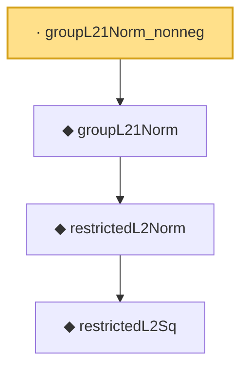

# Proof narrative — groupL21Norm_nonneg

Root: **groupL21Norm_nonneg** (lemma) `Statlib/Regression/groupL21Norm_nonneg.lean:9` · topic `Regression`
Closure: 4 declarations across 4 files. Generated from `proof_graph.json` — no files were moved.

Reading order (foundations first, headline last):

      ◆ `restrictedL2Sq` — def · `Statlib/Regression/restrictedL2Sq.lean:10`
    ◆ `restrictedL2Norm` — noncomputable def · `Statlib/Regression/restrictedL2Norm.lean:9`
  ◆ `groupL21Norm` — noncomputable def · `Statlib/Regression/groupL21Norm.lean:11`  _(also used by 2: groupLassoLoss, group_lasso_basic_inequality)_
· `groupL21Norm_nonneg` — lemma · `Statlib/Regression/groupL21Norm_nonneg.lean:9` **← headline**

## Dependency diagram

