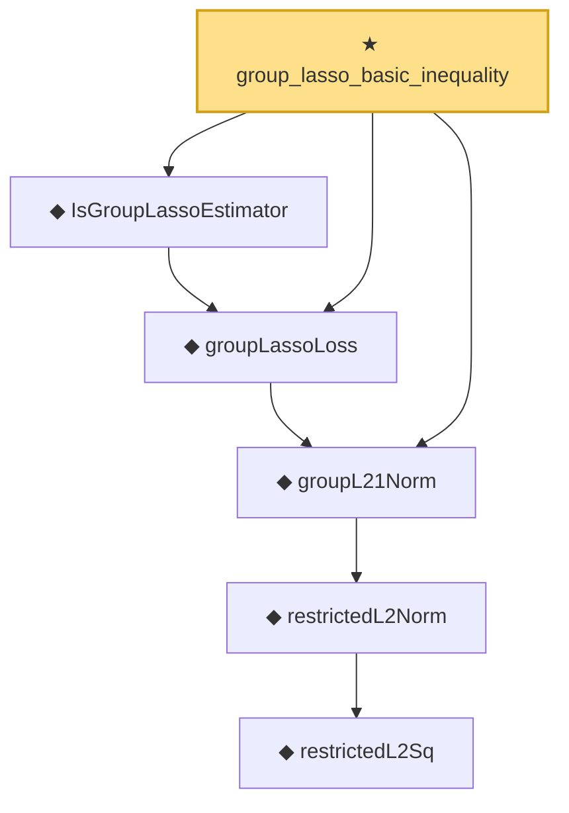

# Proof narrative — group_lasso_basic_inequality

Root: **group_lasso_basic_inequality** (theorem) `Statlib/Regression/group_lasso_basic_inequality.lean:24` · topic `Regression`
Closure: 6 declarations across 6 files. Generated from `proof_graph.json` — no files were moved.

Reading order (foundations first, headline last):

          ◆ `restrictedL2Sq` — def · `Statlib/Regression/restrictedL2Sq.lean:10`
        ◆ `restrictedL2Norm` — noncomputable def · `Statlib/Regression/restrictedL2Norm.lean:9`
  ◆ `groupL21Norm` — noncomputable def · `Statlib/Regression/groupL21Norm.lean:11`  _(also used by 1: groupL21Norm_nonneg)_
  ◆ `groupLassoLoss` — noncomputable def · `Statlib/Regression/groupLassoLoss.lean:12`  _(also used by 1: IsGroupLassoEstimator.loss_le)_
  ◆ `IsGroupLassoEstimator` — def · `Statlib/Regression/IsGroupLassoEstimator.lean:10`  _(also used by 1: IsGroupLassoEstimator.loss_le)_
★ `group_lasso_basic_inequality` — theorem · `Statlib/Regression/group_lasso_basic_inequality.lean:24` **← headline**

## Dependency diagram

