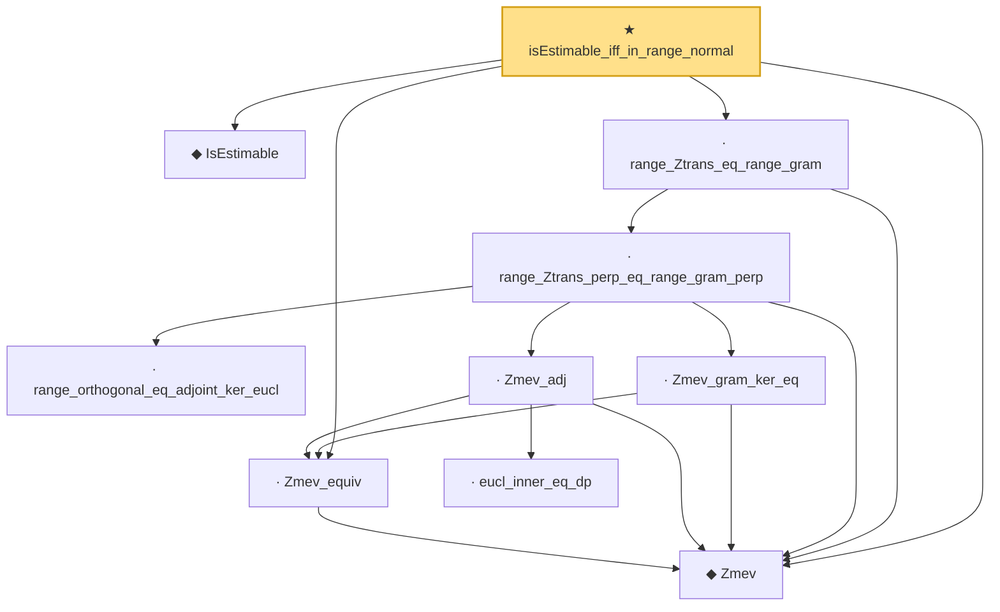

# Proof narrative — isEstimable_iff_in_range_normal

Root: **isEstimable_iff_in_range_normal** (theorem) `Statlib/Regression/isEstimable_iff_in_range_normal.lean:25` · topic `Regression`
Closure: 10 declarations across 10 files. Generated from `proof_graph.json` — no files were moved.

Reading order (foundations first, headline last):

  ◆ `IsEstimable` — def · `Statlib/Regression/IsEstimable.lean:21`  _(also used by 8: estimable_wellDefined, exists_linear_unbiased_iff_estimable, isEstimable_iff_in_range_Q, …)_
  ◆ `Zmev` — noncomputable def · `Statlib/Regression/Zmev.lean:15`  _(also used by 1: not_estimable_under_gaussian)_
  · `Zmev_equiv` — lemma · `Statlib/Regression/Zmev_equiv.lean:16`  _(also used by 1: not_estimable_under_gaussian)_
      · `range_orthogonal_eq_adjoint_ker_eucl` — lemma · `Statlib/Regression/range_orthogonal_eq_adjoint_ker_eucl.lean:15`  _(also used by 1: not_estimable_under_gaussian)_
        · `eucl_inner_eq_dp` — lemma · `Statlib/Regression/eucl_inner_eq_dp.lean:30`  _(also used by 1: not_estimable_under_gaussian)_
      · `Zmev_adj` — lemma · `Statlib/Regression/Zmev_adj.lean:18`  _(also used by 1: not_estimable_under_gaussian)_
      · `Zmev_gram_ker_eq` — lemma · `Statlib/Regression/Zmev_gram_ker_eq.lean:17`
    · `range_Ztrans_perp_eq_range_gram_perp` — lemma · `Statlib/Regression/range_Ztrans_perp_eq_range_gram_perp.lean:19`
  · `range_Ztrans_eq_range_gram` — lemma · `Statlib/Regression/range_Ztrans_eq_range_gram.lean:17`
★ `isEstimable_iff_in_range_normal` — theorem · `Statlib/Regression/isEstimable_iff_in_range_normal.lean:25` **← headline**

## Dependency diagram

