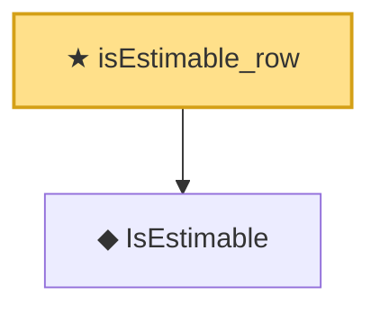

# Proof narrative — isEstimable_row

Root: **isEstimable_row** (theorem) `Statlib/Regression/isEstimable_row.lean:17` · topic `Regression`
Closure: 2 declarations across 2 files. Generated from `proof_graph.json` — no files were moved.

Reading order (foundations first, headline last):

  ◆ `IsEstimable` — def · `Statlib/Regression/IsEstimable.lean:21`  _(also used by 8: estimable_wellDefined, exists_linear_unbiased_iff_estimable, isEstimable_iff_in_range_Q, …)_
★ `isEstimable_row` — theorem · `Statlib/Regression/isEstimable_row.lean:17` **← headline**

## Dependency diagram

