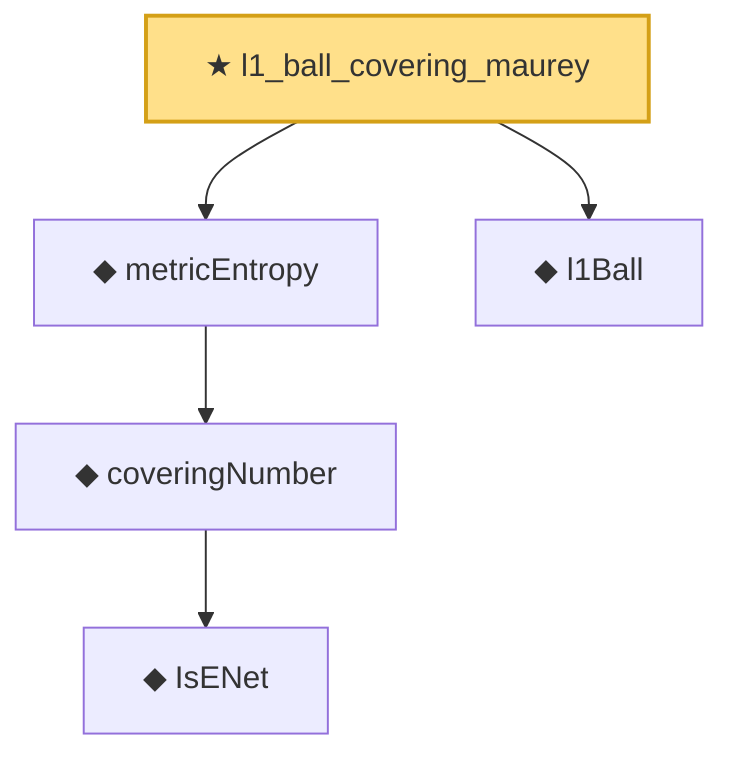

# Proof narrative — l1_ball_covering_maurey

Root: **l1_ball_covering_maurey** (theorem) `Statlib/Regression/l1_ball_covering_maurey.lean:16` · topic `Regression`
Closure: 5 declarations across 3 files. Generated from `proof_graph.json` — no files were moved.

Reading order (foundations first, headline last):

      ◆ `IsENet` — def · `Statlib/EmpiricalProcess/CoveringNumber.lean:26`  _(also used by 5: coveringNumber_anti, coveringNumber_mono, coveringNumber_lt_top_of_totallyBounded, …)_
    ◆ `coveringNumber` — def · `Statlib/EmpiricalProcess/CoveringNumber.lean:31`  _(also used by 11: coveringNumber_anti, coveringNumber_mono, coveringNumber_lt_top_of_totallyBounded, …)_
  ◆ `metricEntropy` — def · `Statlib/EmpiricalProcess/CoveringNumber.lean:35`  _(also used by 1: entropyIntegral)_
  ◆ `l1Ball` — def · `Statlib/Regression/l1Ball.lean:9`
★ `l1_ball_covering_maurey` — theorem · `Statlib/Regression/l1_ball_covering_maurey.lean:16` **← headline**

## Dependency diagram

