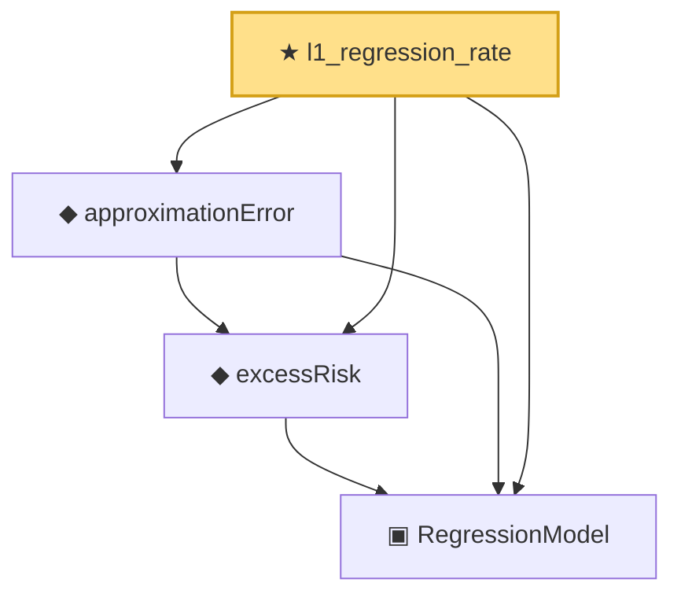

# Proof narrative — l1_regression_rate

Root: **l1_regression_rate** (theorem) `Statlib/Regression/l1_regression_rate.lean:9` · topic `Regression`
Closure: 4 declarations across 3 files. Generated from `proof_graph.json` — no files were moved.

Reading order (foundations first, headline last):

  ▣ `RegressionModel` — structure · `Statlib/Regression/Basic.lean:29`  _(also used by 80: IsStarShapedClass, LocalGaussianComplexity, LocalGaussianComplexityEntropyAssumptions, …)_
  ◆ `excessRisk` — def · `Statlib/Regression/Basic.lean:44`  _(also used by 41: l1_regression_full_interface_of_probability_structured_master_bound, l1_regression_full_interface_of_process_and_complexity_structured_master_bound, l1_regression_full_interface_of_process_and_entropy_structured_master_bound, …)_
  ◆ `approximationError` — def · `Statlib/Regression/approximationError.lean:10`  _(also used by 41: l1_regression_full_interface_of_probability_structured_master_bound, l1_regression_full_interface_of_process_and_complexity_structured_master_bound, l1_regression_full_interface_of_process_and_entropy_structured_master_bound, …)_
★ `l1_regression_rate` — theorem · `Statlib/Regression/l1_regression_rate.lean:9` **← headline**

## Dependency diagram

