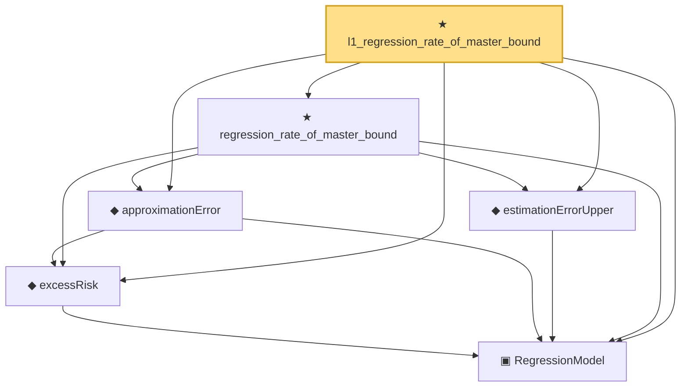

# Proof narrative — l1_regression_rate_of_master_bound

Root: **l1_regression_rate_of_master_bound** (theorem) `Statlib/Regression/l1_regression_rate_of_master_bound.lean:13` · topic `Regression`
Closure: 6 declarations across 5 files. Generated from `proof_graph.json` — no files were moved.

Reading order (foundations first, headline last):

  ▣ `RegressionModel` — structure · `Statlib/Regression/Basic.lean:29`  _(also used by 78: IsStarShapedClass, LocalGaussianComplexity, LocalGaussianComplexityEntropyAssumptions, …)_
  ◆ `excessRisk` — def · `Statlib/Regression/Basic.lean:44`  _(also used by 40: l1_regression_full_interface_of_probability_structured_master_bound, l1_regression_full_interface_of_process_and_complexity_structured_master_bound, l1_regression_full_interface_of_process_and_entropy_structured_master_bound, …)_
  ◆ `approximationError` — def · `Statlib/Regression/approximationError.lean:10`  _(also used by 40: l1_regression_full_interface_of_probability_structured_master_bound, l1_regression_full_interface_of_process_and_complexity_structured_master_bound, l1_regression_full_interface_of_process_and_entropy_structured_master_bound, …)_
  ◆ `estimationErrorUpper` — def · `Statlib/Regression/estimationErrorUpper.lean:11`  _(also used by 50: LocalGaussianComplexityProxyAssumptions, LocalizedDeterministicAssumptions.ofProcessAndComplexity, LocalizedDeterministicAssumptions.ofProcessAndEntropy, …)_
  ★ `regression_rate_of_master_bound` — theorem · `Statlib/Regression/regression_rate_of_master_bound.lean:11`  _(also used by 3: linear_regression_rate_of_master_bound, regression_full_interface_of_probability_structured_master_bound, regression_rate_of_deterministic_structured_master_bound)_
★ `l1_regression_rate_of_master_bound` — theorem · `Statlib/Regression/l1_regression_rate_of_master_bound.lean:13` **← headline**

## Dependency diagram

