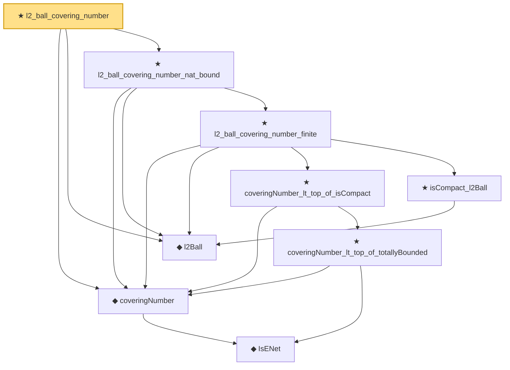

# Proof narrative — l2_ball_covering_number

Root: **l2_ball_covering_number** (theorem) `Statlib/Regression/l2_ball_covering_number.lean:13` · topic `Regression`
Closure: 9 declarations across 6 files. Generated from `proof_graph.json` — no files were moved.

Reading order (foundations first, headline last):

    ◆ `IsENet` — def · `Statlib/EmpiricalProcess/CoveringNumber.lean:26`  _(also used by 4: coveringNumber_anti, coveringNumber_mono, exists_finset_enet_of_totallyBounded, …)_
  ◆ `coveringNumber` — def · `Statlib/EmpiricalProcess/CoveringNumber.lean:31`  _(also used by 7: metricEntropy, coveringNumber_anti, coveringNumber_mono, …)_
  ◆ `l2Ball` — def · `Statlib/Regression/l2Ball.lean:9`
        ★ `coveringNumber_lt_top_of_totallyBounded` — theorem · `Statlib/EmpiricalProcess/CoveringNumber.lean:66`
      ★ `coveringNumber_lt_top_of_isCompact` — theorem · `Statlib/EmpiricalProcess/CoveringNumber.lean:84`
      ★ `isCompact_l2Ball` — theorem · `Statlib/Regression/isCompact_l2Ball.lean:10`
    ★ `l2_ball_covering_number_finite` — theorem · `Statlib/Regression/l2_ball_covering_number_finite.lean:11`
  ★ `l2_ball_covering_number_nat_bound` — theorem · `Statlib/Regression/l2_ball_covering_number_nat_bound.lean:11`
★ `l2_ball_covering_number` — theorem · `Statlib/Regression/l2_ball_covering_number.lean:13` **← headline**

## Dependency diagram

