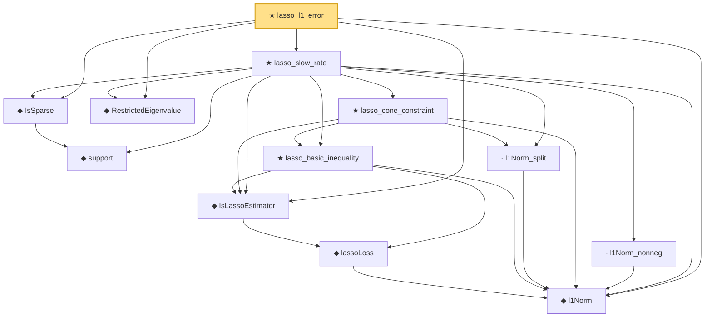

# Proof narrative — lasso_l1_error

Root: **lasso_l1_error** (theorem) `Statlib/Regression/lasso_l1_error.lean:14` · topic `Regression`
Closure: 12 declarations across 11 files. Generated from `proof_graph.json` — no files were moved.

Reading order (foundations first, headline last):

  ◆ `l1Norm` — def · `Statlib/Regression/l1Norm.lean:15`  _(also used by 19: IsDantzigSelector, IsDantzigSelector.l1_le_truth, IsSqrtLassoEstimator.l1_diff_bound, …)_
    ◆ `lassoLoss` — noncomputable def · `Statlib/Regression/lassoLoss.lean:16`  _(also used by 3: IsAdaptiveLassoEstimator.isLassoEstimator_of_w_one, elasticNetLoss_eq_lasso_of_lam2_zero, fusedLassoLoss_eq_lasso_of_lam2_zero)_
  ◆ `IsLassoEstimator` — def · `Statlib/Regression/IsLassoEstimator.lean:15`  _(also used by 3: IsAdaptiveLassoEstimator.isLassoEstimator_of_w_one, lasso_l2_error_on_support, lasso_prediction_error)_
    ◆ `support` — noncomputable def · `Statlib/HDStats/Basic.lean:51`  _(also used by 3: isSparse_iff_card_support, support_smul_subset, lasso_l2_error_on_support)_
  ◆ `IsSparse` — def · `Statlib/HDStats/Basic.lean:56`  _(also used by 13: IsBestSSparseApprox, IsBestSSparseApprox_self_of_sparse, IsIhtStep.isSparse, …)_
  ◆ `RestrictedEigenvalue` — def · `Statlib/Regression/RestrictedEigenvalue.lean:18`  _(also used by 3: lasso_l2_error_on_support, lasso_prediction_error, sqrt_lasso_oracle_bound)_
    ★ `lasso_basic_inequality` — theorem · `Statlib/Regression/lasso_basic_inequality.lean:31`
    · `l1Norm_split` — lemma · `Statlib/Regression/l1Norm_split.lean:14`
    ★ `lasso_cone_constraint` — theorem · `Statlib/Regression/lasso_cone_constraint.lean:41`  _(also used by 1: lasso_l2_error_on_support)_
    · `l1Norm_nonneg` — lemma · `Statlib/Regression/l1Norm_nonneg.lean:13`  _(also used by 6: elasticNetLoss_nonneg, fusedLassoLoss_nonneg, lasso_l2_error_on_support, …)_
  ★ `lasso_slow_rate` — theorem · `Statlib/Regression/lasso_slow_rate.lean:23`  _(also used by 2: lasso_l2_error_on_support, lasso_prediction_error)_
★ `lasso_l1_error` — theorem · `Statlib/Regression/lasso_l1_error.lean:14` **← headline**

## Dependency diagram

