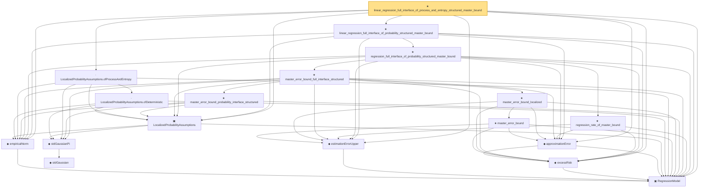

# Proof narrative — linear_regression_full_interface_of_process_and_entropy_structured_master_bound

Root: **linear_regression_full_interface_of_process_and_entropy_structured_master_bound** (theorem) `Statlib/Regression/linear_regression_full_interface_of_process_and_entropy_structured_master_bound.lean:11` · topic `Regression`
Closure: 18 declarations across 16 files. Generated from `proof_graph.json` — no files were moved.

Reading order (foundations first, headline last):

  ▣ `RegressionModel` — structure · `Statlib/Regression/Basic.lean:29`  _(also used by 68: IsStarShapedClass, LocalGaussianComplexity, LocalGaussianComplexityEntropyAssumptions, …)_
  ◆ `empiricalNorm` — def · `Statlib/Regression/empiricalNorm.lean:10`  _(also used by 19: LocalizedProbabilityAssumptions.ofProcessAndComplexity, LocalizedProbabilityAssumptions.ofProxy, empiricalSphere, …)_
  ◆ `estimationErrorUpper` — def · `Statlib/Regression/estimationErrorUpper.lean:11`  _(also used by 45: LocalGaussianComplexityProxyAssumptions, LocalizedDeterministicAssumptions.ofProcessAndComplexity, LocalizedDeterministicAssumptions.ofProcessAndEntropy, …)_
  ◆ `excessRisk` — def · `Statlib/Regression/Basic.lean:44`  _(also used by 35: l1_regression_full_interface_of_probability_structured_master_bound, l1_regression_full_interface_of_process_and_complexity_structured_master_bound, l1_regression_full_interface_of_process_and_entropy_structured_master_bound, …)_
  ◆ `approximationError` — def · `Statlib/Regression/approximationError.lean:10`  _(also used by 35: l1_regression_full_interface_of_probability_structured_master_bound, l1_regression_full_interface_of_process_and_complexity_structured_master_bound, l1_regression_full_interface_of_process_and_entropy_structured_master_bound, …)_
      ◆ `stdGaussian` — abbrev · `Statlib/Gaussian/Basic.lean:29`  _(also used by 97: TensorizationLSIAt, stdGaussianPi_absolutelyContinuous, integrable_mul_gaussianPDFReal_of_memLp, …)_
    ◆ `stdGaussianPi` — def · `Statlib/Gaussian/Basic.lean:32`  _(also used by 64: TensorizationLSIAt, GaussianSobolevRegularity, isProbabilityMeasure_stdGaussianPi, …)_
  ▣ `LocalizedProbabilityAssumptions` — structure · `Statlib/Regression/LocalizedProbabilityAssumptions.lean:12`  _(also used by 14: LocalizedProbabilityAssumptions.ofProcessAndComplexity, LocalizedProbabilityAssumptions.ofProxy, l1_regression_full_interface_of_probability_structured_master_bound, …)_
    · `LocalizedProbabilityAssumptions.ofDeterministic` — lemma · `Statlib/Regression/LocalizedProbabilityAssumptions_ofDeterministic.lean:13`  _(also used by 2: LocalizedProbabilityAssumptions.ofProcessAndComplexity, LocalizedProbabilityAssumptions.ofProxy)_
  · `LocalizedProbabilityAssumptions.ofProcessAndEntropy` — lemma · `Statlib/Regression/LocalizedProbabilityAssumptions_ofProcessAndEntropy.lean:15`  _(also used by 3: l1_regression_full_interface_of_process_and_entropy_structured_master_bound, master_error_bound_full_interface_of_process_and_entropy_structured, regression_full_interface_of_process_and_entropy_structured_master_bound)_
          ★ `master_error_bound` — theorem · `Statlib/Regression/master_error_bound.lean:17`
        ★ `master_error_bound_localized` — theorem · `Statlib/Regression/master_error_bound_localized.lean:14`  _(also used by 3: master_error_bound_full_interface, master_error_bound_localized_of_proxy_critical, master_error_bound_localized_structured)_
        ★ `master_error_bound_probability_interface_structured` — theorem · `Statlib/Regression/master_error_bound_probability_interface_structured.lean:13`
      ★ `master_error_bound_full_interface_structured` — theorem · `Statlib/Regression/master_error_bound_full_interface_structured.lean:17`  _(also used by 3: master_error_bound_full_interface_of_process_and_complexity_structured, master_error_bound_full_interface_of_process_and_entropy_structured, master_error_bound_full_interface_of_proxy_structured)_
      ★ `regression_rate_of_master_bound` — theorem · `Statlib/Regression/regression_rate_of_master_bound.lean:11`  _(also used by 3: l1_regression_rate_of_master_bound, linear_regression_rate_of_master_bound, regression_rate_of_deterministic_structured_master_bound)_
    ★ `regression_full_interface_of_probability_structured_master_bound` — theorem · `Statlib/Regression/regression_full_interface_of_probability_structured_master_bound.lean:12`  _(also used by 4: l1_regression_full_interface_of_probability_structured_master_bound, regression_full_interface_of_process_and_complexity_structured_master_bound, regression_full_interface_of_process_and_entropy_structured_master_bound, …)_
  ★ `linear_regression_full_interface_of_probability_structured_master_bound` — theorem · `Statlib/Regression/linear_regression_full_interface_of_probability_structured_master_bound.lean:11`  _(also used by 2: linear_regression_full_interface_of_process_and_complexity_structured_master_bound, linear_regression_full_interface_of_proxy_structured_master_bound)_
★ `linear_regression_full_interface_of_process_and_entropy_structured_master_bound` — theorem · `Statlib/Regression/linear_regression_full_interface_of_process_and_entropy_structured_master_bound.lean:11` **← headline**

## Dependency diagram

