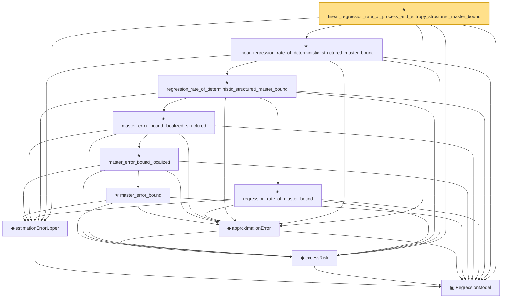

# Proof narrative — linear_regression_rate_of_process_and_entropy_structured_master_bound

Root: **linear_regression_rate_of_process_and_entropy_structured_master_bound** (theorem) `Statlib/Regression/linear_regression_rate_of_process_and_entropy_structured_master_bound.lean:10` · topic `Regression`
Closure: 11 declarations across 10 files. Generated from `proof_graph.json` — no files were moved.

Reading order (foundations first, headline last):

  ▣ `RegressionModel` — structure · `Statlib/Regression/Basic.lean:29`  _(also used by 73: IsStarShapedClass, LocalGaussianComplexity, LocalGaussianComplexityEntropyAssumptions, …)_
  ◆ `estimationErrorUpper` — def · `Statlib/Regression/estimationErrorUpper.lean:11`  _(also used by 45: LocalGaussianComplexityProxyAssumptions, LocalizedDeterministicAssumptions.ofProcessAndComplexity, LocalizedDeterministicAssumptions.ofProcessAndEntropy, …)_
  ◆ `excessRisk` — def · `Statlib/Regression/Basic.lean:44`  _(also used by 35: l1_regression_full_interface_of_probability_structured_master_bound, l1_regression_full_interface_of_process_and_complexity_structured_master_bound, l1_regression_full_interface_of_process_and_entropy_structured_master_bound, …)_
  ◆ `approximationError` — def · `Statlib/Regression/approximationError.lean:10`  _(also used by 35: l1_regression_full_interface_of_probability_structured_master_bound, l1_regression_full_interface_of_process_and_complexity_structured_master_bound, l1_regression_full_interface_of_process_and_entropy_structured_master_bound, …)_
          ★ `master_error_bound` — theorem · `Statlib/Regression/master_error_bound.lean:17`
        ★ `master_error_bound_localized` — theorem · `Statlib/Regression/master_error_bound_localized.lean:14`  _(also used by 3: master_error_bound_full_interface, master_error_bound_full_interface_structured, master_error_bound_localized_of_proxy_critical)_
      ★ `master_error_bound_localized_structured` — theorem · `Statlib/Regression/master_error_bound_localized_structured.lean:14`  _(also used by 3: master_error_bound_localized_of_process_and_complexity_structured, master_error_bound_localized_of_process_and_entropy_structured, master_error_bound_localized_of_proxy_structured)_
      ★ `regression_rate_of_master_bound` — theorem · `Statlib/Regression/regression_rate_of_master_bound.lean:11`  _(also used by 3: l1_regression_rate_of_master_bound, linear_regression_rate_of_master_bound, regression_full_interface_of_probability_structured_master_bound)_
    ★ `regression_rate_of_deterministic_structured_master_bound` — theorem · `Statlib/Regression/regression_rate_of_deterministic_structured_master_bound.lean:11`  _(also used by 4: l1_regression_rate_of_deterministic_structured_master_bound, regression_rate_of_process_and_complexity_structured_master_bound, regression_rate_of_process_and_entropy_structured_master_bound, …)_
  ★ `linear_regression_rate_of_deterministic_structured_master_bound` — theorem · `Statlib/Regression/linear_regression_rate_of_deterministic_structured_master_bound.lean:11`  _(also used by 2: linear_regression_rate_of_process_and_complexity_structured_master_bound, linear_regression_rate_of_proxy_structured_master_bound)_
★ `linear_regression_rate_of_process_and_entropy_structured_master_bound` — theorem · `Statlib/Regression/linear_regression_rate_of_process_and_entropy_structured_master_bound.lean:10` **← headline**

## Dependency diagram

