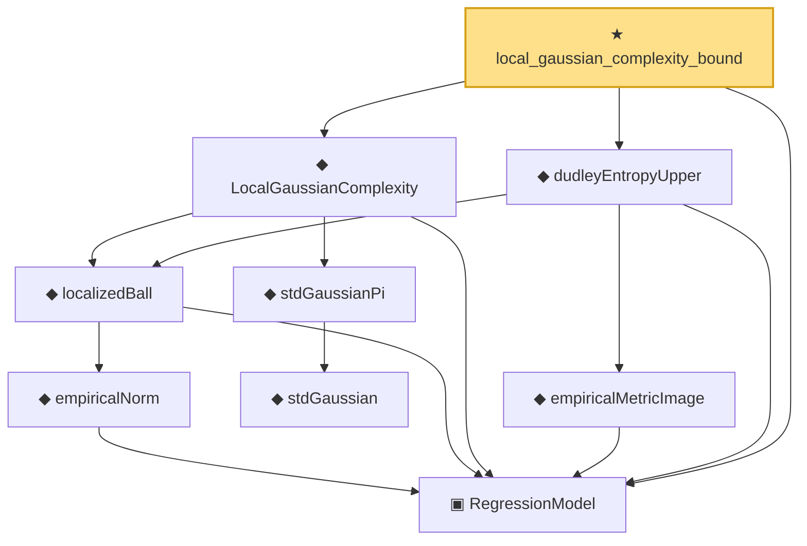

# Proof narrative — local_gaussian_complexity_bound

Root: **local_gaussian_complexity_bound** (theorem) `Statlib/Regression/local_gaussian_complexity_bound.lean:13` · topic `Regression`
Closure: 9 declarations across 8 files. Generated from `proof_graph.json` — no files were moved.

Reading order (foundations first, headline last):

  ▣ `RegressionModel` — structure · `Statlib/Regression/Basic.lean:29`  _(also used by 77: excessRisk, IsStarShapedClass, LocalGaussianComplexityEntropyAssumptions, …)_
      ◆ `empiricalNorm` — def · `Statlib/Regression/empiricalNorm.lean:10`  _(also used by 26: LocalizedProbabilityAssumptions, LocalizedProbabilityAssumptions.ofDeterministic, LocalizedProbabilityAssumptions.ofProcessAndComplexity, …)_
    ◆ `localizedBall` — def · `Statlib/Regression/localizedBall.lean:11`  _(also used by 5: LocalGaussianComplexityEntropyAssumptions, LocalizedDeterministicAssumptions, LocalizedProcessAssumptions, …)_
      ◆ `stdGaussian` — abbrev · `Statlib/Gaussian/Basic.lean:29`  _(also used by 97: TensorizationLSIAt, stdGaussianPi_absolutelyContinuous, integrable_mul_gaussianPDFReal_of_memLp, …)_
    ◆ `stdGaussianPi` — def · `Statlib/Gaussian/Basic.lean:32`  _(also used by 68: TensorizationLSIAt, GaussianSobolevRegularity, isProbabilityMeasure_stdGaussianPi, …)_
  ◆ `LocalGaussianComplexity` — def · `Statlib/Regression/LocalGaussianComplexity.lean:11`  _(also used by 10: LocalGaussianComplexityEntropyAssumptions, LocalGaussianComplexityProxyAssumptions, LocalizedProxyCriticalAssumptions, …)_
    ◆ `empiricalMetricImage` — def · `Statlib/Regression/empiricalMetricImage.lean:11`  _(also used by 2: LocalGaussianComplexityEntropyAssumptions, dudleyEntropyUpper_le_estimationErrorUpper_of_entropyIntegral_le_Msq)_
  ◆ `dudleyEntropyUpper` — def · `Statlib/Regression/dudleyEntropyUpper.lean:12`  _(also used by 4: LocalGaussianComplexityEntropyAssumptions, LocalGaussianComplexityProxyAssumptions, dudleyEntropyUpper_le_estimationErrorUpper_of_entropyIntegral_le_Msq, …)_
★ `local_gaussian_complexity_bound` — theorem · `Statlib/Regression/local_gaussian_complexity_bound.lean:13` **← headline**

## Dependency diagram

