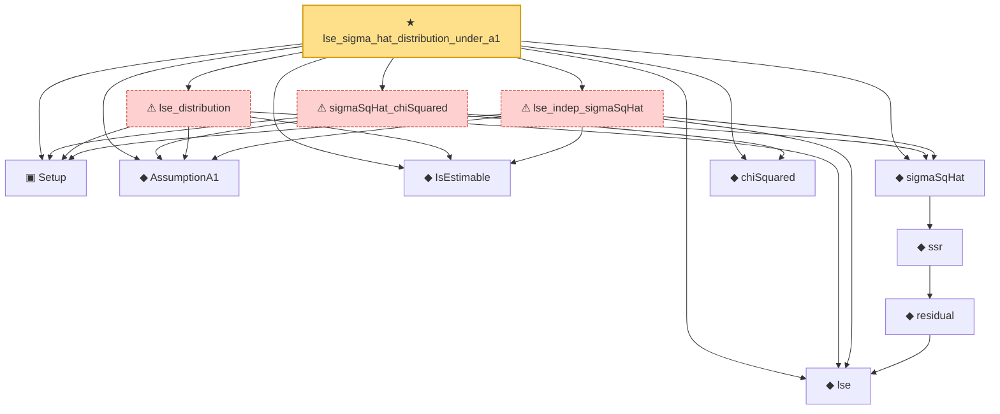

# Proof narrative — lse_sigma_hat_distribution_under_a1

Root: **lse_sigma_hat_distribution_under_a1** (theorem) `Statlib/Regression/NormalLinearModel.lean:251` · topic `Regression`
Closure: 12 declarations across 1 files. Generated from `proof_graph.json` — no files were moved.

Reading order (foundations first, headline last):

  ▣ `Setup` — structure · `Statlib/Regression/NormalLinearModel.lean:82`  _(also used by 5: AssumptionA1, lse, residual, …)_
  ◆ `AssumptionA1` — def · `Statlib/Regression/NormalLinearModel.lean:131`
  ◆ `IsEstimable` — def · `Statlib/Regression/NormalLinearModel.lean:106`
  ◆ `lse` — def · `Statlib/Regression/NormalLinearModel.lean:111`
      ◆ `residual` — def · `Statlib/Regression/NormalLinearModel.lean:115`  _(also used by 5: LinearModel.residual, gauss_markov, gauss_markov_sq, …)_
    ◆ `ssr` — def · `Statlib/Regression/NormalLinearModel.lean:119`
  ◆ `sigmaSqHat` — def · `Statlib/Regression/NormalLinearModel.lean:123`
  ◆ `chiSquared` — def · `Statlib/Regression/NormalLinearModel.lean:70`
  ⚠ `lse_indep_sigmaSqHat` — axiom · `Statlib/Regression/NormalLinearModel.lean:162`
  ⚠ `lse_distribution` — axiom · `Statlib/Regression/NormalLinearModel.lean:196`
  ⚠ `sigmaSqHat_chiSquared` — axiom · `Statlib/Regression/NormalLinearModel.lean:230`
★ `lse_sigma_hat_distribution_under_a1` — theorem · `Statlib/Regression/NormalLinearModel.lean:251` **← headline**

## Dependency diagram

