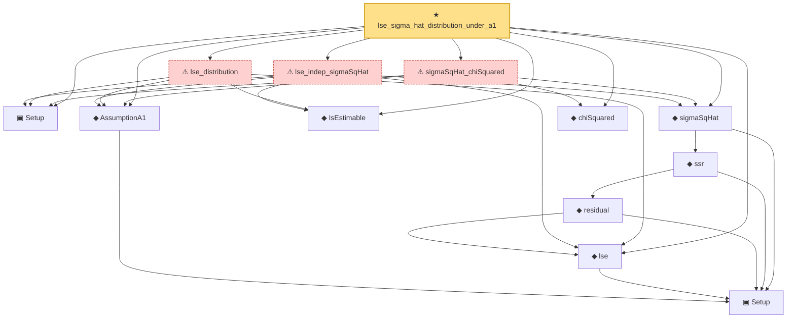

# Proof narrative — lse_sigma_hat_distribution_under_a1

Root: **lse_sigma_hat_distribution_under_a1** (theorem) `Statlib/Regression/lse_sigma_hat_distribution_under_a1.lean:31` · topic `Regression`
Closure: 13 declarations across 13 files. Generated from `proof_graph.json` — no files were moved.

Reading order (foundations first, headline last):

  ▣ `Setup` — structure · `Statlib/Regression/Setup.lean:20`
    ▣ `Setup` — structure · `Statlib/Regression/NormalLinearModel.lean:82`  _(also used by 4: lse_indep_sigmaSqHat, lse_distribution, sigmaSqHat_chiSquared, …)_
  ◆ `AssumptionA1` — def · `Statlib/Regression/AssumptionA1.lean:19`
  ◆ `IsEstimable` — def · `Statlib/Regression/IsEstimable.lean:21`  _(also used by 6: estimable_wellDefined, exists_linear_unbiased_iff_estimable, isEstimable_iff_in_range_Q, …)_
  ◆ `lse` — def · `Statlib/Regression/lse.lean:17`
      ◆ `residual` — def · `Statlib/Regression/residual.lean:17`
    ◆ `ssr` — def · `Statlib/Regression/ssr.lean:17`
  ◆ `sigmaSqHat` — def · `Statlib/Regression/sigmaSqHat.lean:17`
  ◆ `chiSquared` — def · `Statlib/Regression/chiSquared.lean:15`
  ⚠ `lse_indep_sigmaSqHat` — axiom · `Statlib/Regression/lse_indep_sigmaSqHat.lean:46`
  ⚠ `lse_distribution` — axiom · `Statlib/Regression/lse_distribution.lean:45`
  ⚠ `sigmaSqHat_chiSquared` — axiom · `Statlib/Regression/sigmaSqHat_chiSquared.lean:43`
★ `lse_sigma_hat_distribution_under_a1` — theorem · `Statlib/Regression/lse_sigma_hat_distribution_under_a1.lean:31` **← headline**

## Dependency diagram

