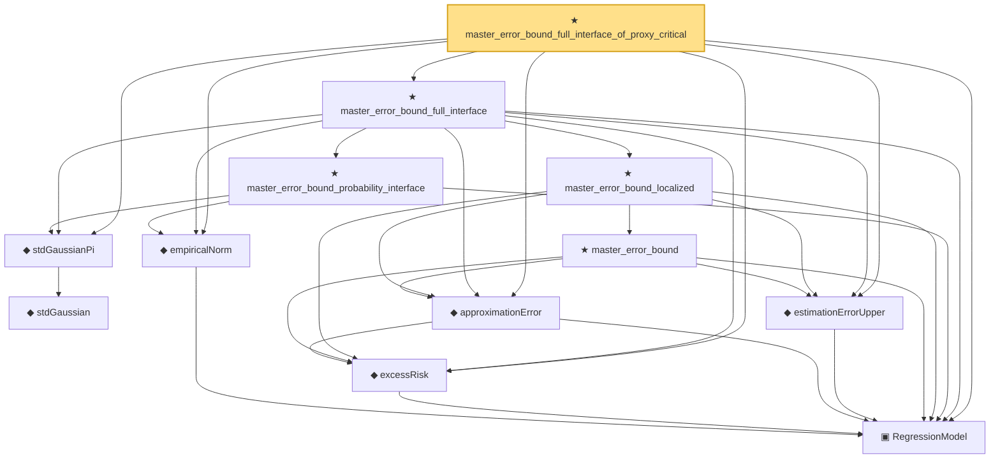

# Proof narrative — master_error_bound_full_interface_of_proxy_critical

Root: **master_error_bound_full_interface_of_proxy_critical** (theorem) `Statlib/Regression/master_error_bound_full_interface_of_proxy_critical.lean:15` · topic `Regression`
Closure: 12 declarations across 10 files. Generated from `proof_graph.json` — no files were moved.

Reading order (foundations first, headline last):

  ▣ `RegressionModel` — structure · `Statlib/Regression/Basic.lean:29`  _(also used by 74: IsStarShapedClass, LocalGaussianComplexity, LocalGaussianComplexityEntropyAssumptions, …)_
    ◆ `stdGaussian` — abbrev · `Statlib/Gaussian/Basic.lean:29`  _(also used by 97: TensorizationLSIAt, stdGaussianPi_absolutelyContinuous, integrable_mul_gaussianPDFReal_of_memLp, …)_
  ◆ `stdGaussianPi` — def · `Statlib/Gaussian/Basic.lean:32`  _(also used by 66: TensorizationLSIAt, GaussianSobolevRegularity, isProbabilityMeasure_stdGaussianPi, …)_
  ◆ `empiricalNorm` — def · `Statlib/Regression/empiricalNorm.lean:10`  _(also used by 24: LocalizedProbabilityAssumptions, LocalizedProbabilityAssumptions.ofDeterministic, LocalizedProbabilityAssumptions.ofProcessAndComplexity, …)_
  ◆ `excessRisk` — def · `Statlib/Regression/Basic.lean:44`  _(also used by 38: l1_regression_full_interface_of_probability_structured_master_bound, l1_regression_full_interface_of_process_and_complexity_structured_master_bound, l1_regression_full_interface_of_process_and_entropy_structured_master_bound, …)_
  ◆ `approximationError` — def · `Statlib/Regression/approximationError.lean:10`  _(also used by 38: l1_regression_full_interface_of_probability_structured_master_bound, l1_regression_full_interface_of_process_and_complexity_structured_master_bound, l1_regression_full_interface_of_process_and_entropy_structured_master_bound, …)_
  ◆ `estimationErrorUpper` — def · `Statlib/Regression/estimationErrorUpper.lean:11`  _(also used by 48: LocalGaussianComplexityProxyAssumptions, LocalizedDeterministicAssumptions.ofProcessAndComplexity, LocalizedDeterministicAssumptions.ofProcessAndEntropy, …)_
      ★ `master_error_bound` — theorem · `Statlib/Regression/master_error_bound.lean:17`
    ★ `master_error_bound_localized` — theorem · `Statlib/Regression/master_error_bound_localized.lean:14`  _(also used by 3: master_error_bound_full_interface_structured, master_error_bound_localized_of_proxy_critical, master_error_bound_localized_structured)_
    ★ `master_error_bound_probability_interface` — theorem · `Statlib/Regression/master_error_bound_probability_interface.lean:12`
  ★ `master_error_bound_full_interface` — theorem · `Statlib/Regression/master_error_bound_full_interface.lean:16`
★ `master_error_bound_full_interface_of_proxy_critical` — theorem · `Statlib/Regression/master_error_bound_full_interface_of_proxy_critical.lean:15` **← headline**

## Dependency diagram

