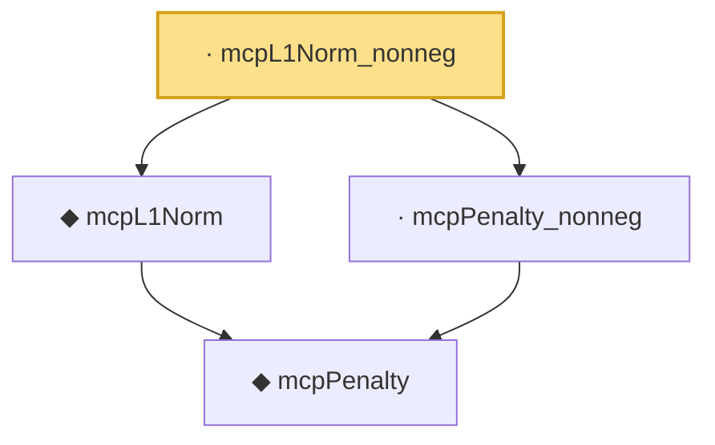

# Proof narrative — mcpL1Norm_nonneg

Root: **mcpL1Norm_nonneg** (lemma) `Statlib/Regression/mcpL1Norm_nonneg.lean:10` · topic `Regression`
Closure: 4 declarations across 4 files. Generated from `proof_graph.json` — no files were moved.

Reading order (foundations first, headline last):

    ◆ `mcpPenalty` — noncomputable def · `Statlib/Regression/mcpPenalty.lean:10`  _(also used by 3: mcpPenalty_eq_const_of_abs_gt_gam_lam, mcpPenalty_eq_quadratic_of_abs_le_gam_lam, mcpPenalty_neg)_
  ◆ `mcpL1Norm` — noncomputable def · `Statlib/Regression/mcpL1Norm.lean:11`  _(also used by 1: mcpLoss)_
  · `mcpPenalty_nonneg` — lemma · `Statlib/Regression/mcpPenalty_nonneg.lean:9`
· `mcpL1Norm_nonneg` — lemma · `Statlib/Regression/mcpL1Norm_nonneg.lean:10` **← headline**

## Dependency diagram

