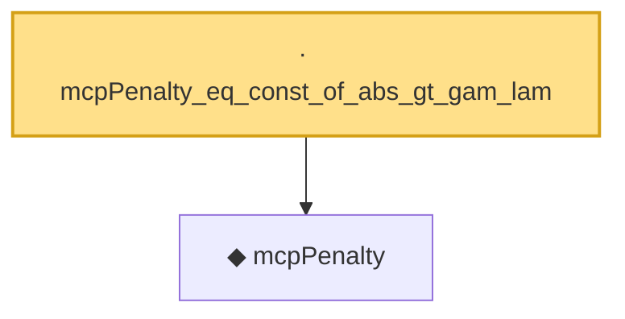

# Proof narrative — mcpPenalty_eq_const_of_abs_gt_gam_lam

Root: **mcpPenalty_eq_const_of_abs_gt_gam_lam** (lemma) `Statlib/Regression/mcpPenalty_eq_const_of_abs_gt_gam_lam.lean:9` · topic `Regression`
Closure: 2 declarations across 2 files. Generated from `proof_graph.json` — no files were moved.

Reading order (foundations first, headline last):

  ◆ `mcpPenalty` — noncomputable def · `Statlib/Regression/mcpPenalty.lean:10`  _(also used by 4: mcpL1Norm, mcpPenalty_eq_quadratic_of_abs_le_gam_lam, mcpPenalty_neg, …)_
· `mcpPenalty_eq_const_of_abs_gt_gam_lam` — lemma · `Statlib/Regression/mcpPenalty_eq_const_of_abs_gt_gam_lam.lean:9` **← headline**

## Dependency diagram

