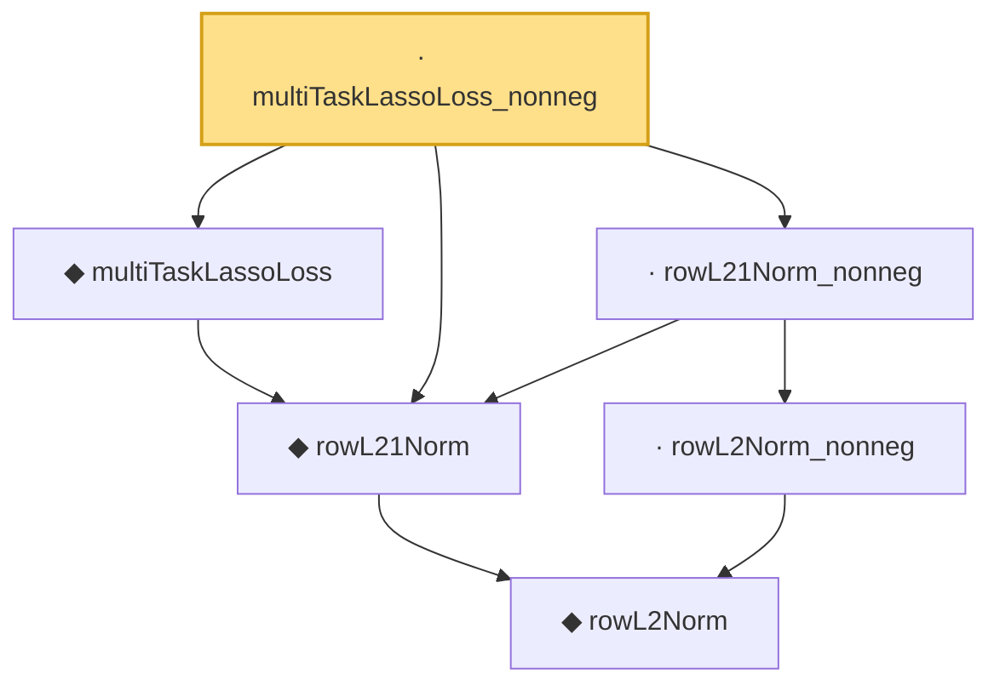

# Proof narrative — multiTaskLassoLoss_nonneg

Root: **multiTaskLassoLoss_nonneg** (lemma) `Statlib/Regression/multiTaskLassoLoss_nonneg.lean:12` · topic `Regression`
Closure: 6 declarations across 6 files. Generated from `proof_graph.json` — no files were moved.

Reading order (foundations first, headline last):

      ◆ `rowL2Norm` — noncomputable def · `Statlib/Regression/rowL2Norm.lean:8`
  ◆ `rowL21Norm` — noncomputable def · `Statlib/Regression/rowL21Norm.lean:9`
  ◆ `multiTaskLassoLoss` — noncomputable def · `Statlib/Regression/multiTaskLassoLoss.lean:10`  _(also used by 1: IsMultiTaskLassoEstimator)_
    · `rowL2Norm_nonneg` — lemma · `Statlib/Regression/rowL2Norm_nonneg.lean:8`
  · `rowL21Norm_nonneg` — lemma · `Statlib/Regression/rowL21Norm_nonneg.lean:9`
· `multiTaskLassoLoss_nonneg` — lemma · `Statlib/Regression/multiTaskLassoLoss_nonneg.lean:12` **← headline**

## Dependency diagram

