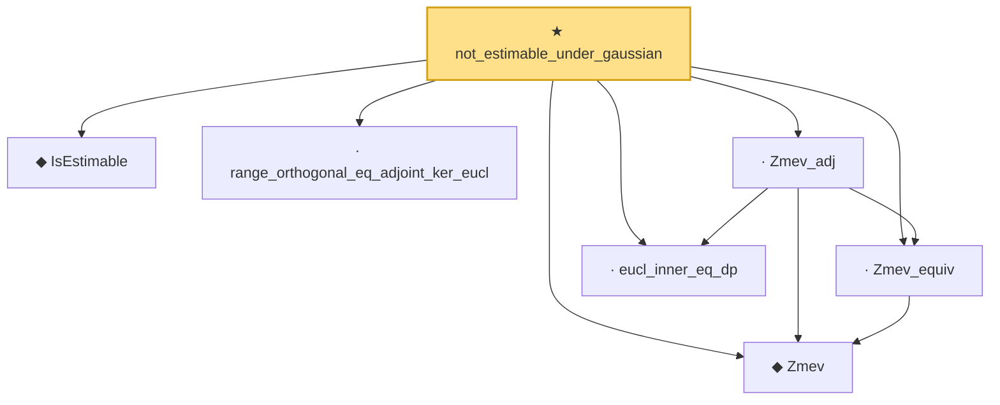

# Proof narrative — not_estimable_under_gaussian

Root: **not_estimable_under_gaussian** (theorem) `Statlib/Regression/not_estimable_under_gaussian.lean:36` · topic `Regression`
Closure: 7 declarations across 7 files. Generated from `proof_graph.json` — no files were moved.

Reading order (foundations first, headline last):

  ◆ `IsEstimable` — def · `Statlib/Regression/IsEstimable.lean:21`  _(also used by 8: estimable_wellDefined, exists_linear_unbiased_iff_estimable, isEstimable_iff_in_range_Q, …)_
  ◆ `Zmev` — noncomputable def · `Statlib/Regression/Zmev.lean:15`  _(also used by 4: Zmev_gram_ker_eq, isEstimable_iff_in_range_normal, range_Ztrans_eq_range_gram, …)_
  · `Zmev_equiv` — lemma · `Statlib/Regression/Zmev_equiv.lean:16`  _(also used by 2: Zmev_gram_ker_eq, isEstimable_iff_in_range_normal)_
  · `eucl_inner_eq_dp` — lemma · `Statlib/Regression/eucl_inner_eq_dp.lean:30`
  · `range_orthogonal_eq_adjoint_ker_eucl` — lemma · `Statlib/Regression/range_orthogonal_eq_adjoint_ker_eucl.lean:15`  _(also used by 1: range_Ztrans_perp_eq_range_gram_perp)_
  · `Zmev_adj` — lemma · `Statlib/Regression/Zmev_adj.lean:18`  _(also used by 1: range_Ztrans_perp_eq_range_gram_perp)_
★ `not_estimable_under_gaussian` — theorem · `Statlib/Regression/not_estimable_under_gaussian.lean:36` **← headline**

## Dependency diagram

