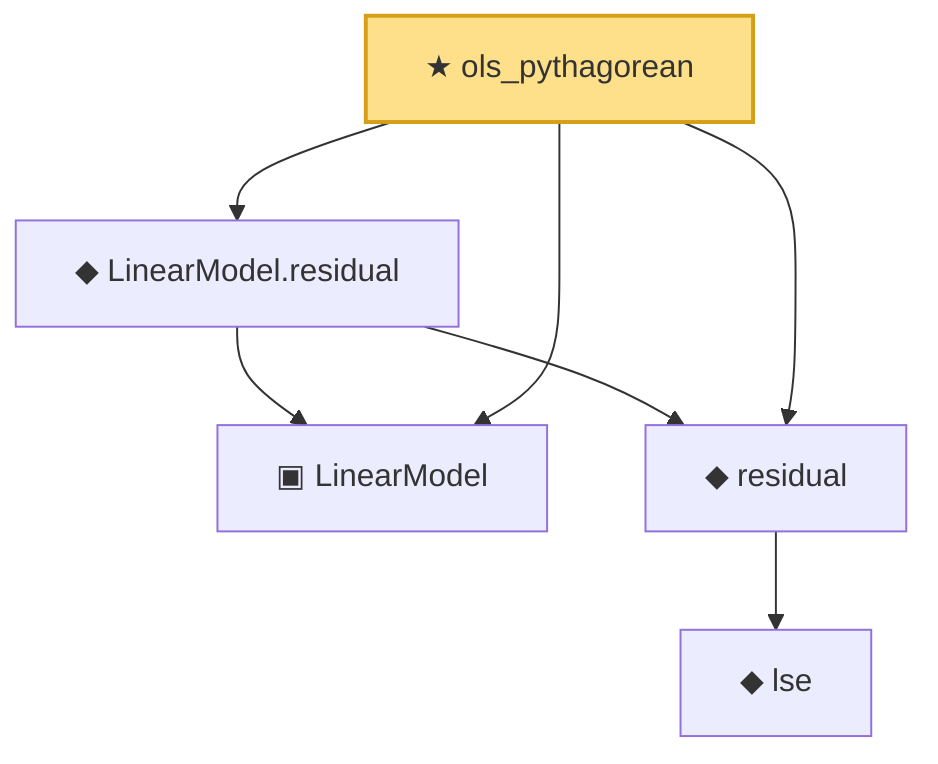

# Proof narrative — ols_pythagorean

Root: **ols_pythagorean** (theorem) `Statlib/Regression/ols_pythagorean.lean:12` · topic `Regression`
Closure: 5 declarations across 4 files. Generated from `proof_graph.json` — no files were moved.

Reading order (foundations first, headline last):

  ▣ `LinearModel` — structure · `Statlib/Regression/LinearModel.lean:11`  _(also used by 4: LinearModel.ols, gauss_markov, gauss_markov_sq, …)_
    ◆ `lse` — def · `Statlib/Regression/NormalLinearModel.lean:111`  _(also used by 3: lse_indep_sigmaSqHat, lse_distribution, lse_sigma_hat_distribution_under_a1)_
  ◆ `residual` — def · `Statlib/Regression/NormalLinearModel.lean:115`  _(also used by 4: ssr, gauss_markov, gauss_markov_sq, …)_
  ◆ `LinearModel.residual` — def · `Statlib/Regression/LinearModel_residual.lean:11`  _(also used by 1: gauss_markov)_
★ `ols_pythagorean` — theorem · `Statlib/Regression/ols_pythagorean.lean:12` **← headline**

## Dependency diagram

