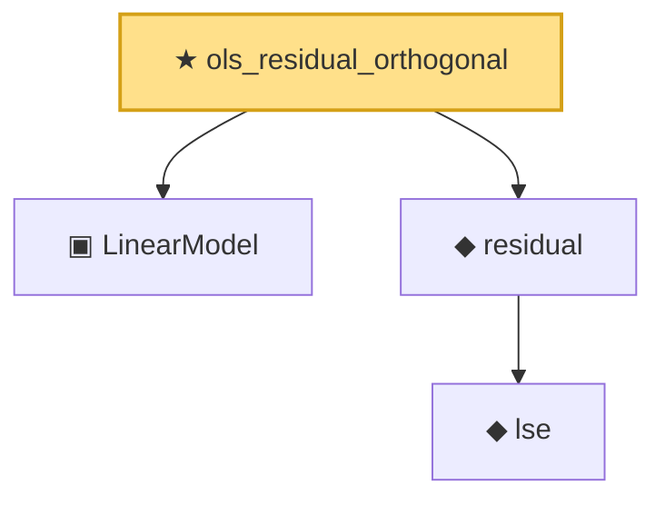

# Proof narrative — ols_residual_orthogonal

Root: **ols_residual_orthogonal** (theorem) `Statlib/Regression/ols_residual_orthogonal.lean:11` · topic `Regression`
Closure: 4 declarations across 3 files. Generated from `proof_graph.json` — no files were moved.

Reading order (foundations first, headline last):

  ▣ `LinearModel` — structure · `Statlib/Regression/LinearModel.lean:11`  _(also used by 5: LinearModel.ols, LinearModel.residual, gauss_markov, …)_
    ◆ `lse` — def · `Statlib/Regression/NormalLinearModel.lean:111`  _(also used by 3: lse_indep_sigmaSqHat, lse_distribution, lse_sigma_hat_distribution_under_a1)_
  ◆ `residual` — def · `Statlib/Regression/NormalLinearModel.lean:115`  _(also used by 5: LinearModel.residual, ssr, gauss_markov, …)_
★ `ols_residual_orthogonal` — theorem · `Statlib/Regression/ols_residual_orthogonal.lean:11` **← headline**

## Dependency diagram

