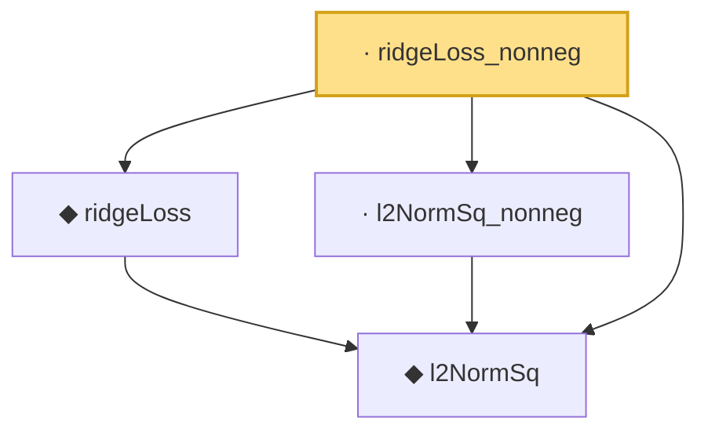

# Proof narrative — ridgeLoss_nonneg

Root: **ridgeLoss_nonneg** (lemma) `Statlib/Regression/ridgeLoss_nonneg.lean:17` · topic `Regression`
Closure: 4 declarations across 4 files. Generated from `proof_graph.json` — no files were moved.

Reading order (foundations first, headline last):

  ◆ `l2NormSq` — def · `Statlib/Regression/l2NormSq.lean:14`  _(also used by 6: IsRidgeEstimator.shrinkage_bound, elasticNetLoss, elasticNetLoss_nonneg, …)_
  ◆ `ridgeLoss` — noncomputable def · `Statlib/Regression/ridgeLoss.lean:15`  _(also used by 3: IsRidgeEstimator, IsRidgeEstimator.shrinkage_bound, elasticNetLoss_eq_ridge_of_lam1_zero)_
  · `l2NormSq_nonneg` — lemma · `Statlib/Regression/l2NormSq_nonneg.lean:12`  _(also used by 1: elasticNetLoss_nonneg)_
· `ridgeLoss_nonneg` — lemma · `Statlib/Regression/ridgeLoss_nonneg.lean:17` **← headline**

## Dependency diagram

