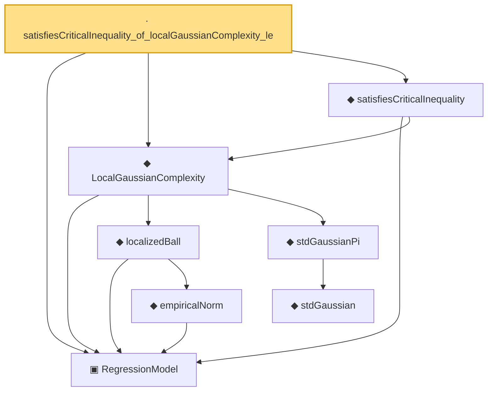

# Proof narrative — satisfiesCriticalInequality_of_localGaussianComplexity_le

Root: **satisfiesCriticalInequality_of_localGaussianComplexity_le** (lemma) `Statlib/Regression/satisfiesCriticalInequality_of_localGaussianComplexity_le.lean:12` · topic `Regression`
Closure: 8 declarations across 7 files. Generated from `proof_graph.json` — no files were moved.

Reading order (foundations first, headline last):

  ▣ `RegressionModel` — structure · `Statlib/Regression/Basic.lean:29`  _(also used by 78: excessRisk, IsStarShapedClass, LocalGaussianComplexityEntropyAssumptions, …)_
      ◆ `empiricalNorm` — def · `Statlib/Regression/empiricalNorm.lean:10`  _(also used by 26: LocalizedProbabilityAssumptions, LocalizedProbabilityAssumptions.ofDeterministic, LocalizedProbabilityAssumptions.ofProcessAndComplexity, …)_
    ◆ `localizedBall` — def · `Statlib/Regression/localizedBall.lean:11`  _(also used by 6: LocalGaussianComplexityEntropyAssumptions, LocalizedDeterministicAssumptions, LocalizedProcessAssumptions, …)_
      ◆ `stdGaussian` — abbrev · `Statlib/Gaussian/Basic.lean:29`  _(also used by 97: TensorizationLSIAt, stdGaussianPi_absolutelyContinuous, integrable_mul_gaussianPDFReal_of_memLp, …)_
    ◆ `stdGaussianPi` — def · `Statlib/Gaussian/Basic.lean:32`  _(also used by 68: TensorizationLSIAt, GaussianSobolevRegularity, isProbabilityMeasure_stdGaussianPi, …)_
  ◆ `LocalGaussianComplexity` — def · `Statlib/Regression/LocalGaussianComplexity.lean:11`  _(also used by 9: LocalGaussianComplexityEntropyAssumptions, LocalGaussianComplexityProxyAssumptions, LocalizedProxyCriticalAssumptions, …)_
  ◆ `satisfiesCriticalInequality` — def · `Statlib/Regression/satisfiesCriticalInequality.lean:11`  _(also used by 7: LocalizedDeterministicAssumptions, LocalizedDeterministicAssumptions.ofProcessAndCI, LocalizedDeterministicAssumptions.ofProcessAndComplexity, …)_
· `satisfiesCriticalInequality_of_localGaussianComplexity_le` — lemma · `Statlib/Regression/satisfiesCriticalInequality_of_localGaussianComplexity_le.lean:12` **← headline**

## Dependency diagram

