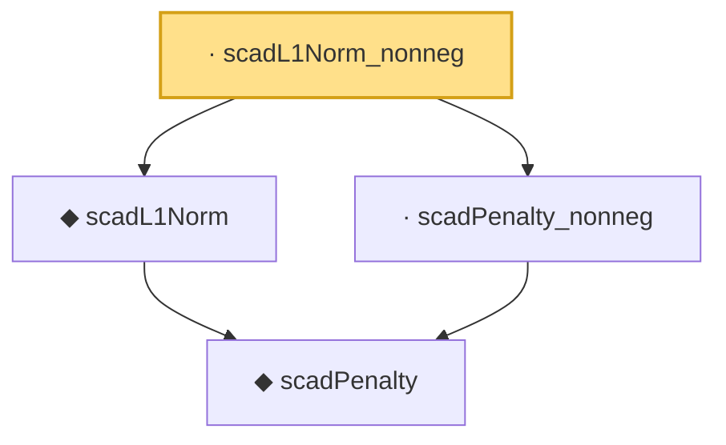

# Proof narrative — scadL1Norm_nonneg

Root: **scadL1Norm_nonneg** (lemma) `Statlib/Regression/scadL1Norm_nonneg.lean:10` · topic `Regression`
Closure: 4 declarations across 4 files. Generated from `proof_graph.json` — no files were moved.

Reading order (foundations first, headline last):

    ◆ `scadPenalty` — noncomputable def · `Statlib/Regression/scadPenalty.lean:10`  _(also used by 3: scadPenalty_eq_const_of_abs_gt_a_lam, scadPenalty_eq_lasso_of_abs_le_lam, scadPenalty_neg)_
  ◆ `scadL1Norm` — noncomputable def · `Statlib/Regression/scadL1Norm.lean:11`  _(also used by 1: scadLoss)_
  · `scadPenalty_nonneg` — lemma · `Statlib/Regression/scadPenalty_nonneg.lean:9`
· `scadL1Norm_nonneg` — lemma · `Statlib/Regression/scadL1Norm_nonneg.lean:10` **← headline**

## Dependency diagram

