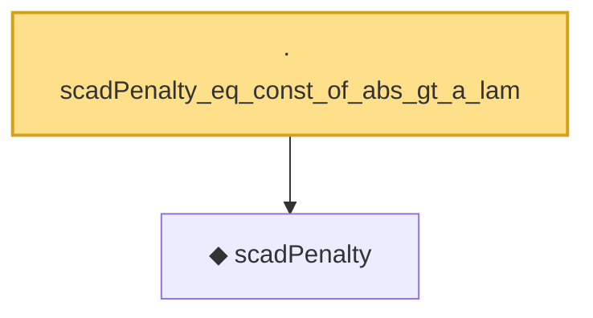

# Proof narrative — scadPenalty_eq_const_of_abs_gt_a_lam

Root: **scadPenalty_eq_const_of_abs_gt_a_lam** (lemma) `Statlib/Regression/scadPenalty_eq_const_of_abs_gt_a_lam.lean:10` · topic `Regression`
Closure: 2 declarations across 2 files. Generated from `proof_graph.json` — no files were moved.

Reading order (foundations first, headline last):

  ◆ `scadPenalty` — noncomputable def · `Statlib/Regression/scadPenalty.lean:10`  _(also used by 4: scadL1Norm, scadPenalty_eq_lasso_of_abs_le_lam, scadPenalty_neg, …)_
· `scadPenalty_eq_const_of_abs_gt_a_lam` — lemma · `Statlib/Regression/scadPenalty_eq_const_of_abs_gt_a_lam.lean:10` **← headline**

## Dependency diagram

