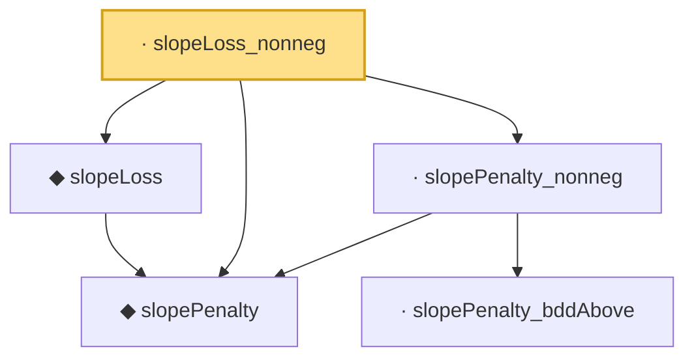

# Proof narrative — slopeLoss_nonneg

Root: **slopeLoss_nonneg** (lemma) `Statlib/Regression/slopeLoss_nonneg.lean:21` · topic `Regression`
Closure: 5 declarations across 5 files. Generated from `proof_graph.json` — no files were moved.

Reading order (foundations first, headline last):

  ◆ `slopePenalty` — noncomputable def · `Statlib/Regression/slopePenalty.lean:18`
  ◆ `slopeLoss` — noncomputable def · `Statlib/Regression/slopeLoss.lean:15`  _(also used by 2: IsSlopeEstimator, IsSlopeEstimator.loss_le_zero)_
    · `slopePenalty_bddAbove` — lemma · `Statlib/Regression/slopePenalty_bddAbove.lean:15`
  · `slopePenalty_nonneg` — lemma · `Statlib/Regression/slopePenalty_nonneg.lean:17`
· `slopeLoss_nonneg` — lemma · `Statlib/Regression/slopeLoss_nonneg.lean:21` **← headline**

## Dependency diagram

