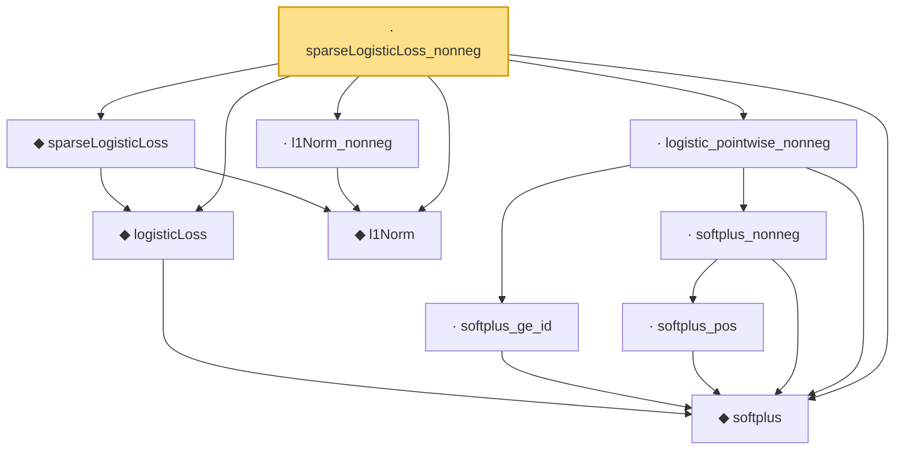

# Proof narrative — sparseLogisticLoss_nonneg

Root: **sparseLogisticLoss_nonneg** (lemma) `Statlib/Regression/sparseLogisticLoss_nonneg.lean:16` · topic `Regression`
Closure: 10 declarations across 10 files. Generated from `proof_graph.json` — no files were moved.

Reading order (foundations first, headline last):

  ◆ `softplus` — noncomputable def · `Statlib/Regression/softplus.lean:14`
  ◆ `logisticLoss` — noncomputable def · `Statlib/Regression/logisticLoss.lean:15`
  ◆ `l1Norm` — def · `Statlib/Regression/l1Norm.lean:15`  _(also used by 23: IsDantzigSelector, IsDantzigSelector.l1_le_truth, IsSqrtLassoEstimator.l1_diff_bound, …)_
  ◆ `sparseLogisticLoss` — noncomputable def · `Statlib/Regression/sparseLogisticLoss.lean:14`  _(also used by 1: IsSparseLogisticEstimator)_
    · `softplus_ge_id` — lemma · `Statlib/Regression/softplus_ge_id.lean:12`
      · `softplus_pos` — lemma · `Statlib/Regression/softplus_pos.lean:11`
    · `softplus_nonneg` — lemma · `Statlib/Regression/softplus_nonneg.lean:12`
  · `logistic_pointwise_nonneg` — lemma · `Statlib/Regression/logistic_pointwise_nonneg.lean:15`
  · `l1Norm_nonneg` — lemma · `Statlib/Regression/l1Norm_nonneg.lean:13`  _(also used by 6: elasticNetLoss_nonneg, fusedLassoLoss_nonneg, lasso_l2_error_on_support, …)_
· `sparseLogisticLoss_nonneg` — lemma · `Statlib/Regression/sparseLogisticLoss_nonneg.lean:16` **← headline**

## Dependency diagram

