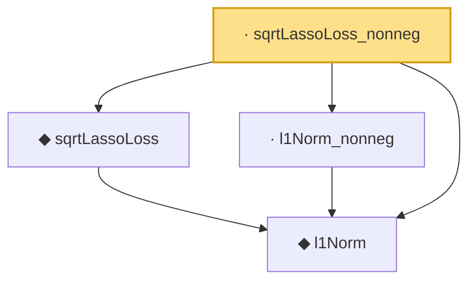

# Proof narrative — sqrtLassoLoss_nonneg

Root: **sqrtLassoLoss_nonneg** (lemma) `Statlib/Regression/sqrtLassoLoss_nonneg.lean:10` · topic `Regression`
Closure: 4 declarations across 4 files. Generated from `proof_graph.json` — no files were moved.

Reading order (foundations first, headline last):

  ◆ `l1Norm` — def · `Statlib/Regression/l1Norm.lean:15`  _(also used by 23: IsDantzigSelector, IsDantzigSelector.l1_le_truth, IsSqrtLassoEstimator.l1_diff_bound, …)_
  ◆ `sqrtLassoLoss` — noncomputable def · `Statlib/Regression/sqrtLassoLoss.lean:10`  _(also used by 4: IsSqrtLassoEstimator, IsSqrtLassoEstimator.l1_diff_bound, IsSqrtLassoEstimator.le_at_reference, …)_
  · `l1Norm_nonneg` — lemma · `Statlib/Regression/l1Norm_nonneg.lean:13`  _(also used by 6: elasticNetLoss_nonneg, fusedLassoLoss_nonneg, lasso_l2_error_on_support, …)_
· `sqrtLassoLoss_nonneg` — lemma · `Statlib/Regression/sqrtLassoLoss_nonneg.lean:10` **← headline**

## Dependency diagram

