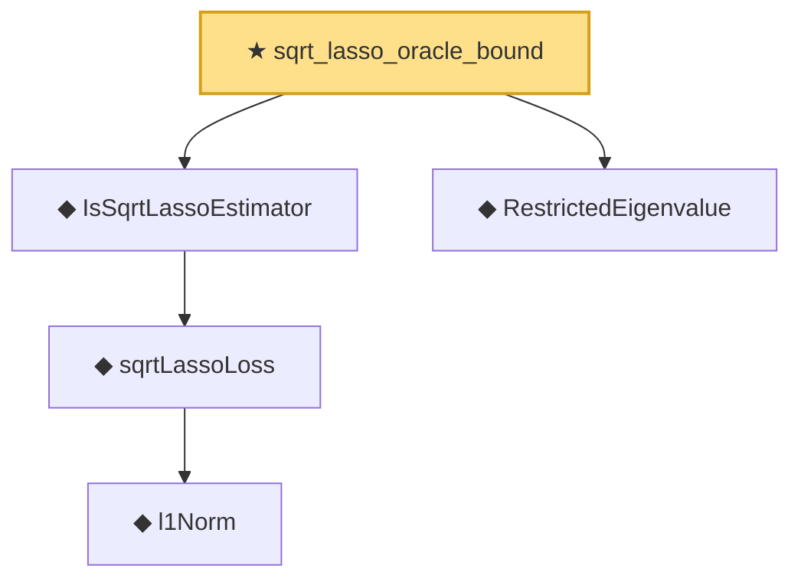

# Proof narrative — sqrt_lasso_oracle_bound

Root: **sqrt_lasso_oracle_bound** (theorem) `Statlib/Regression/sqrt_lasso_oracle_bound.lean:28` · topic `Regression`
Closure: 5 declarations across 5 files. Generated from `proof_graph.json` — no files were moved.

Reading order (foundations first, headline last):

      ◆ `l1Norm` — def · `Statlib/Regression/l1Norm.lean:15`  _(also used by 25: IsDantzigSelector, IsDantzigSelector.l1_le_truth, IsSqrtLassoEstimator.l1_diff_bound, …)_
    ◆ `sqrtLassoLoss` — noncomputable def · `Statlib/Regression/sqrtLassoLoss.lean:10`  _(also used by 4: IsSqrtLassoEstimator.l1_diff_bound, IsSqrtLassoEstimator.le_at_reference, sqrtLassoLoss_nonneg, …)_
  ◆ `IsSqrtLassoEstimator` — def · `Statlib/Regression/IsSqrtLassoEstimator.lean:11`  _(also used by 3: IsSqrtLassoEstimator.l1_diff_bound, IsSqrtLassoEstimator.le_at_reference, sqrt_lasso_basic_inequality)_
  ◆ `RestrictedEigenvalue` — def · `Statlib/Regression/RestrictedEigenvalue.lean:18`  _(also used by 4: lasso_l1_error, lasso_l2_error_on_support, lasso_prediction_error, …)_
★ `sqrt_lasso_oracle_bound` — theorem · `Statlib/Regression/sqrt_lasso_oracle_bound.lean:28` **← headline**

## Dependency diagram

