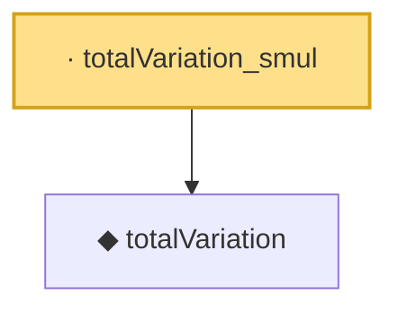

# Proof narrative — totalVariation_smul

Root: **totalVariation_smul** (lemma) `Statlib/Regression/totalVariation_smul.lean:9` · topic `Regression`
Closure: 2 declarations across 2 files. Generated from `proof_graph.json` — no files were moved.

Reading order (foundations first, headline last):

  ◆ `totalVariation` — def · `Statlib/Regression/totalVariation.lean:13`  _(also used by 4: fusedLassoLoss, fusedLassoLoss_nonneg, totalVariation_const, …)_
· `totalVariation_smul` — lemma · `Statlib/Regression/totalVariation_smul.lean:9` **← headline**

## Dependency diagram

