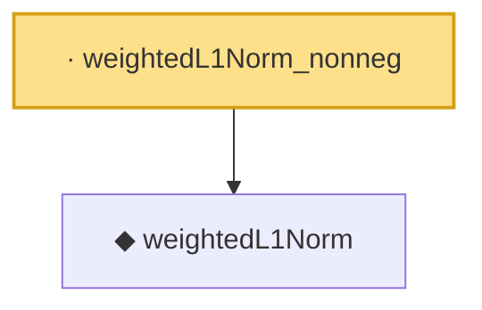

# Proof narrative — weightedL1Norm_nonneg

Root: **weightedL1Norm_nonneg** (lemma) `Statlib/Regression/weightedL1Norm_nonneg.lean:8` · topic `Regression`
Closure: 2 declarations across 2 files. Generated from `proof_graph.json` — no files were moved.

Reading order (foundations first, headline last):

  ◆ `weightedL1Norm` — def · `Statlib/Regression/weightedL1Norm.lean:11`  _(also used by 3: adaptiveLassoLoss, adaptive_lasso_basic_inequality, weightedL1Norm_one_eq_l1Norm)_
· `weightedL1Norm_nonneg` — lemma · `Statlib/Regression/weightedL1Norm_nonneg.lean:8` **← headline**

## Dependency diagram

