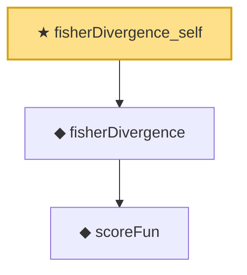

# Proof narrative — fisherDivergence_self

Root: **fisherDivergence_self** (theorem) `Statlib/ScoreMatching/fisherDivergence_self.lean:12` · topic `ScoreMatching`
Closure: 3 declarations across 3 files. Generated from `proof_graph.json` — no files were moved.

Reading order (foundations first, headline last):

    ◆ `scoreFun` — noncomputable def · `Statlib/ScoreMatching/scoreFun.lean:15`  _(also used by 2: hyvarinenLoss, scoreFun_zero_at_zero)_
  ◆ `fisherDivergence` — noncomputable def · `Statlib/ScoreMatching/fisherDivergence.lean:17`  _(also used by 1: score_matching_minimum_at_truth)_
★ `fisherDivergence_self` — theorem · `Statlib/ScoreMatching/fisherDivergence_self.lean:12` **← headline**

## Dependency diagram

