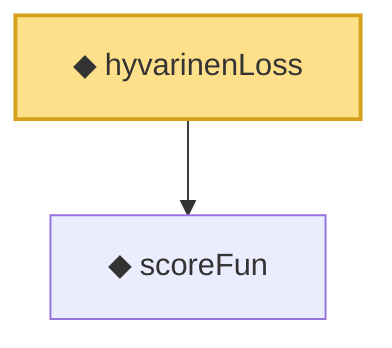

# Proof narrative — hyvarinenLoss

Root: **hyvarinenLoss** (noncomputable def) `Statlib/ScoreMatching/hyvarinenLoss.lean:23` · topic `ScoreMatching`
Closure: 2 declarations across 2 files. Generated from `proof_graph.json` — no files were moved.

Reading order (foundations first, headline last):

  ◆ `scoreFun` — noncomputable def · `Statlib/ScoreMatching/scoreFun.lean:15`  _(also used by 2: fisherDivergence, scoreFun_zero_at_zero)_
◆ `hyvarinenLoss` — noncomputable def · `Statlib/ScoreMatching/hyvarinenLoss.lean:23` **← headline**

## Dependency diagram

