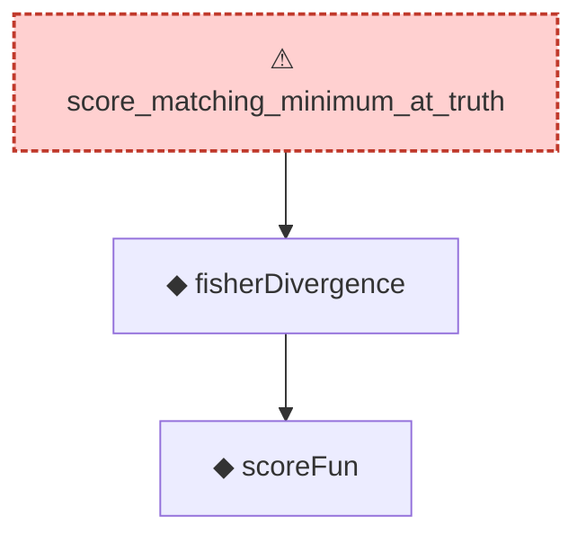

# Proof narrative — score_matching_minimum_at_truth

Root: **score_matching_minimum_at_truth** (axiom) `Statlib/ScoreMatching/score_matching_minimum_at_truth.lean:19` · topic `ScoreMatching`
Closure: 3 declarations across 3 files. Generated from `proof_graph.json` — no files were moved.

Reading order (foundations first, headline last):

    ◆ `scoreFun` — noncomputable def · `Statlib/ScoreMatching/scoreFun.lean:15`  _(also used by 2: hyvarinenLoss, scoreFun_zero_at_zero)_
  ◆ `fisherDivergence` — noncomputable def · `Statlib/ScoreMatching/fisherDivergence.lean:17`  _(also used by 1: fisherDivergence_self)_
⚠ `score_matching_minimum_at_truth` — axiom · `Statlib/ScoreMatching/score_matching_minimum_at_truth.lean:19` **← headline**

## Dependency diagram

> ⚠ `score_matching_minimum_at_truth` is an **axiom** (no proof body), so its closure only covers declarations referenced in its *statement*. Supporting lemmas in `ScoreMatching/` that were meant to prove it are not edge-connected — a signal that the proof line was atomised then axiomatised apart.
