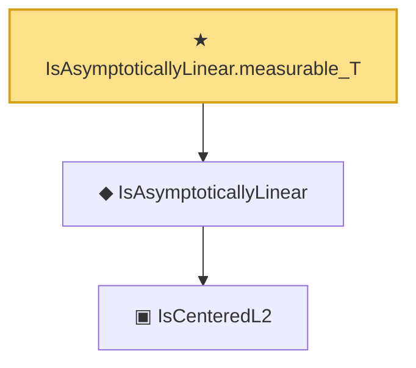

# Proof narrative — IsAsymptoticallyLinear.measurable_T

Root: **IsAsymptoticallyLinear.measurable_T** (theorem) `Statlib/Semiparametric/IsAsymptoticallyLinear_measurable_T.lean:12` · topic `Semiparametric`
Closure: 3 declarations across 3 files. Generated from `proof_graph.json` — no files were moved.

Reading order (foundations first, headline last):

    ▣ `IsCenteredL2` — structure · `Statlib/Semiparametric/IsCenteredL2.lean:14`  _(also used by 6: IsAsymptoticallyLinear.isCenteredL2, add, iid_empirical_sum_clt_axiom, …)_
  ◆ `IsAsymptoticallyLinear` — def · `Statlib/Semiparametric/IsAsymptoticallyLinear.lean:25`  _(also used by 5: IsAsymptoticallyLinear.isCenteredL2, IsAsymptoticallyLinear.remainder_tendsto, asymptotic_linearity_slutsky, …)_
★ `IsAsymptoticallyLinear.measurable_T` — theorem · `Statlib/Semiparametric/IsAsymptoticallyLinear_measurable_T.lean:12` **← headline**

## Dependency diagram

