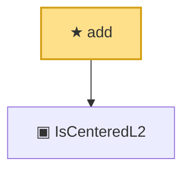

# Proof narrative — add

Root: **add** (theorem) `Statlib/Semiparametric/add.lean:14` · topic `Semiparametric`
Closure: 2 declarations across 2 files. Generated from `proof_graph.json` — no files were moved.

Reading order (foundations first, headline last):

  ▣ `IsCenteredL2` — structure · `Statlib/Semiparametric/IsCenteredL2.lean:14`  _(also used by 6: IsAsymptoticallyLinear, IsAsymptoticallyLinear.isCenteredL2, iid_empirical_sum_clt_axiom, …)_
★ `add` — theorem · `Statlib/Semiparametric/add.lean:14` **← headline**

## Dependency diagram

