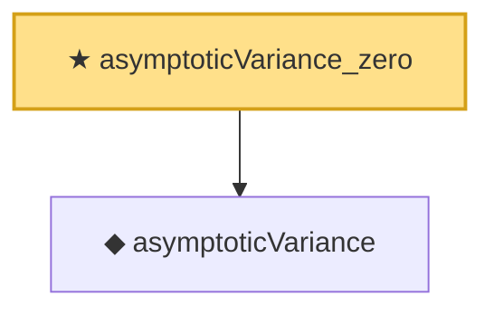

# Proof narrative — asymptoticVariance_zero

Root: **asymptoticVariance_zero** (theorem) `Statlib/Semiparametric/asymptoticVariance_zero.lean:12` · topic `Semiparametric`
Closure: 2 declarations across 2 files. Generated from `proof_graph.json` — no files were moved.

Reading order (foundations first, headline last):

  ◆ `asymptoticVariance` — noncomputable def · `Statlib/Semiparametric/asymptoticVariance.lean:14`  _(also used by 5: asymptoticVariance_nonneg, asymptotic_linearity_slutsky, asymptotic_linearity_slutsky_axiom, …)_
★ `asymptoticVariance_zero` — theorem · `Statlib/Semiparametric/asymptoticVariance_zero.lean:12` **← headline**

## Dependency diagram

