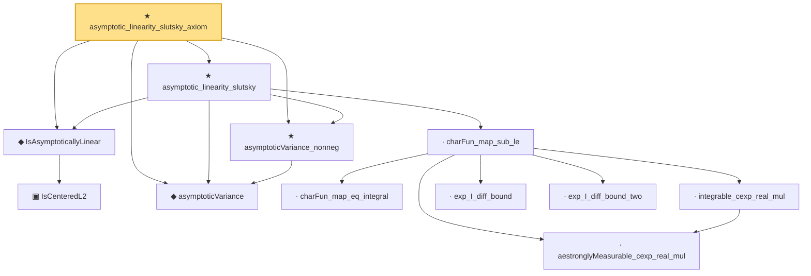

# Proof narrative — asymptotic_linearity_slutsky_axiom

Root: **asymptotic_linearity_slutsky_axiom** (theorem) `Statlib/Semiparametric/asymptotic_linearity_slutsky_axiom.lean:16` · topic `Semiparametric`
Closure: 12 declarations across 12 files. Generated from `proof_graph.json` — no files were moved.

Reading order (foundations first, headline last):

    ▣ `IsCenteredL2` — structure · `Statlib/Semiparametric/IsCenteredL2.lean:14`  _(also used by 6: IsAsymptoticallyLinear.isCenteredL2, add, iid_empirical_sum_clt_axiom, …)_
  ◆ `IsAsymptoticallyLinear` — def · `Statlib/Semiparametric/IsAsymptoticallyLinear.lean:25`  _(also used by 4: IsAsymptoticallyLinear.isCenteredL2, IsAsymptoticallyLinear.measurable_T, IsAsymptoticallyLinear.remainder_tendsto, …)_
  ◆ `asymptoticVariance` — noncomputable def · `Statlib/Semiparametric/asymptoticVariance.lean:14`  _(also used by 3: asymptoticVariance_zero, iid_empirical_sum_clt_axiom, influence_function_asymptotic_normality)_
  ★ `asymptoticVariance_nonneg` — theorem · `Statlib/Semiparametric/asymptoticVariance_nonneg.lean:12`  _(also used by 2: iid_empirical_sum_clt_axiom, influence_function_asymptotic_normality)_
      · `charFun_map_eq_integral` — lemma · `Statlib/Semiparametric/charFun_map_eq_integral.lean:11`
      · `aestronglyMeasurable_cexp_real_mul` — lemma · `Statlib/Semiparametric/aestronglyMeasurable_cexp_real_mul.lean:11`
      · `integrable_cexp_real_mul` — lemma · `Statlib/Semiparametric/integrable_cexp_real_mul.lean:12`
      · `exp_I_diff_bound` — lemma · `Statlib/Semiparametric/exp_I_diff_bound.lean:14`
      · `exp_I_diff_bound_two` — lemma · `Statlib/Semiparametric/exp_I_diff_bound_two.lean:12`
    · `charFun_map_sub_le` — lemma · `Statlib/Semiparametric/charFun_map_sub_le.lean:19`
  ★ `asymptotic_linearity_slutsky` — theorem · `Statlib/Semiparametric/asymptotic_linearity_slutsky.lean:34`  _(also used by 1: influence_function_asymptotic_normality)_
★ `asymptotic_linearity_slutsky_axiom` — theorem · `Statlib/Semiparametric/asymptotic_linearity_slutsky_axiom.lean:16` **← headline**

## Dependency diagram

