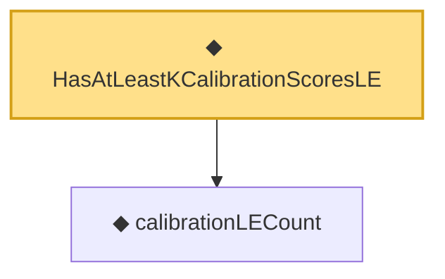

# Proof narrative — HasAtLeastKCalibrationScoresLE

Root: **HasAtLeastKCalibrationScoresLE** (def) `Statlib/StatFoundation/Vocabulary/Conformal.lean:87` · topic `StatFoundation`
Closure: 2 declarations across 1 files. Generated from `proof_graph.json` — no files were moved.

Reading order (foundations first, headline last):

  ◆ `calibrationLECount` — noncomputable def · `Statlib/StatFoundation/Vocabulary/Conformal.lean:81`
◆ `HasAtLeastKCalibrationScoresLE` — def · `Statlib/StatFoundation/Vocabulary/Conformal.lean:87` **← headline**

## Dependency diagram

