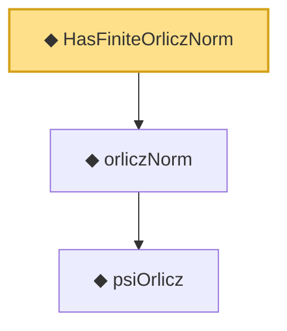

# Proof narrative — HasFiniteOrliczNorm

Root: **HasFiniteOrliczNorm** (def) `Statlib/StatFoundation/Vocabulary/OrliczNorm.lean:51` · topic `StatFoundation`
Closure: 3 declarations across 1 files. Generated from `proof_graph.json` — no files were moved.

Reading order (foundations first, headline last):

    ◆ `psiOrlicz` — noncomputable def · `Statlib/StatFoundation/Vocabulary/OrliczNorm.lean:34`
  ◆ `orliczNorm` — noncomputable def · `Statlib/StatFoundation/Vocabulary/OrliczNorm.lean:45`  _(also used by 2: subgaussianOrliczNorm, subexponentialOrliczNorm)_
◆ `HasFiniteOrliczNorm` — def · `Statlib/StatFoundation/Vocabulary/OrliczNorm.lean:51` **← headline**

## Dependency diagram

