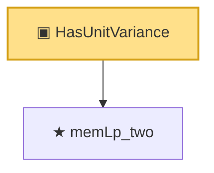

# Proof narrative — HasUnitVariance

Root: **HasUnitVariance** (structure) `Statlib/StatFoundation/Vocabulary/RandomVariable.lean:41` · topic `StatFoundation`
Closure: 2 declarations across 2 files. Generated from `proof_graph.json` — no files were moved.

Reading order (foundations first, headline last):

  ★ `memLp_two` — theorem · `Statlib/StatFoundation/RandomVariable/Gaussian/HilbertSpace.lean:78`  _(also used by 3: variance_eq, integral_sq, inner_eq_integral_mul)_
▣ `HasUnitVariance` — structure · `Statlib/StatFoundation/Vocabulary/RandomVariable.lean:41` **← headline**

## Dependency diagram

