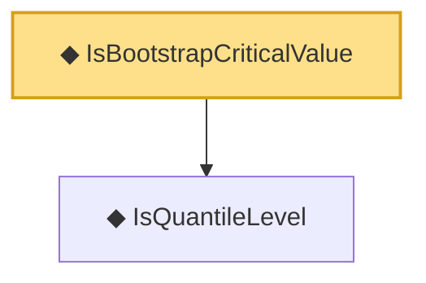

# Proof narrative — IsBootstrapCriticalValue

Root: **IsBootstrapCriticalValue** (def) `Statlib/StatFoundation/Vocabulary/MaxType.lean:67` · topic `StatFoundation`
Closure: 2 declarations across 1 files. Generated from `proof_graph.json` — no files were moved.

Reading order (foundations first, headline last):

  ◆ `IsQuantileLevel` — def · `Statlib/StatFoundation/Vocabulary/MaxType.lean:61`  _(also used by 2: kolmogorov_distance_transfer_to_quantile_coverage, bootstrap_coverage_from_distance_and_anticonc)_
◆ `IsBootstrapCriticalValue` — def · `Statlib/StatFoundation/Vocabulary/MaxType.lean:67` **← headline**

## Dependency diagram

