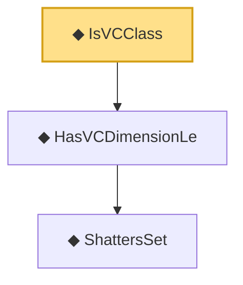

# Proof narrative — IsVCClass

Root: **IsVCClass** (def) `Statlib/StatFoundation/Vocabulary/VCDimension.lean:147` · topic `StatFoundation`
Closure: 3 declarations across 1 files. Generated from `proof_graph.json` — no files were moved.

Reading order (foundations first, headline last):

    ◆ `ShattersSet` — def · `Statlib/StatFoundation/Vocabulary/VCDimension.lean:43`  _(also used by 3: vcDimension, HasVCDimensionRealLe, sauer_shelah_sum_bound)_
  ◆ `HasVCDimensionLe` — def · `Statlib/StatFoundation/Vocabulary/VCDimension.lean:60`  _(also used by 3: HasPseudoDimensionLe, sauer_shelah_sum_bound, growth_function_real_le_sauer_shelah)_
◆ `IsVCClass` — def · `Statlib/StatFoundation/Vocabulary/VCDimension.lean:147` **← headline**

## Dependency diagram

