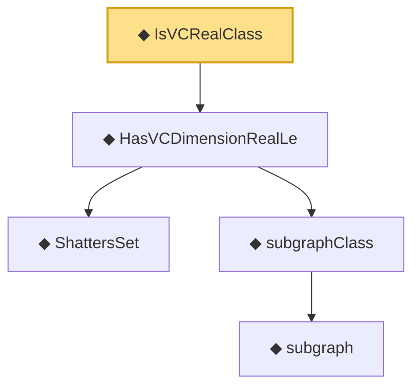

# Proof narrative — IsVCRealClass

Root: **IsVCRealClass** (def) `Statlib/StatFoundation/Vocabulary/VCDimension.lean:151` · topic `StatFoundation`
Closure: 5 declarations across 1 files. Generated from `proof_graph.json` — no files were moved.

Reading order (foundations first, headline last):

    ◆ `ShattersSet` — def · `Statlib/StatFoundation/Vocabulary/VCDimension.lean:43`  _(also used by 3: vcDimension, HasVCDimensionLe, sauer_shelah_sum_bound)_
      ◆ `subgraph` — def · `Statlib/StatFoundation/Vocabulary/VCDimension.lean:83`
    ◆ `subgraphClass` — def · `Statlib/StatFoundation/Vocabulary/VCDimension.lean:87`  _(also used by 3: vcDimensionReal, growthFunctionReal, growth_function_real_le_sauer_shelah)_
  ◆ `HasVCDimensionRealLe` — def · `Statlib/StatFoundation/Vocabulary/VCDimension.lean:109`  _(also used by 1: growth_function_real_le_sauer_shelah)_
◆ `IsVCRealClass` — def · `Statlib/StatFoundation/Vocabulary/VCDimension.lean:151` **← headline**

## Dependency diagram

