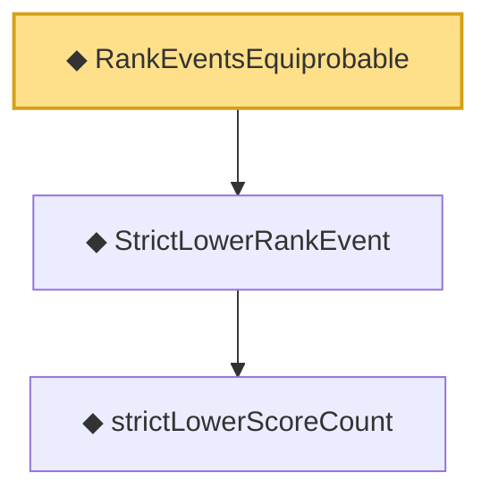

# Proof narrative — RankEventsEquiprobable

Root: **RankEventsEquiprobable** (def) `Statlib/StatFoundation/Vocabulary/Conformal.lean:56` · topic `StatFoundation`
Closure: 3 declarations across 1 files. Generated from `proof_graph.json` — no files were moved.

Reading order (foundations first, headline last):

    ◆ `strictLowerScoreCount` — noncomputable def · `Statlib/StatFoundation/Vocabulary/Conformal.lean:45`  _(also used by 3: strictLowerScoreCount_measurable, strictLowerRankVectorEvent_measurableSet, strictLowerRankEvent_measurableSet)_
  ◆ `StrictLowerRankEvent` — noncomputable def · `Statlib/StatFoundation/Vocabulary/Conformal.lean:50`  _(also used by 1: strictLowerRankEvent_measurableSet)_
◆ `RankEventsEquiprobable` — def · `Statlib/StatFoundation/Vocabulary/Conformal.lean:56` **← headline**

## Dependency diagram

