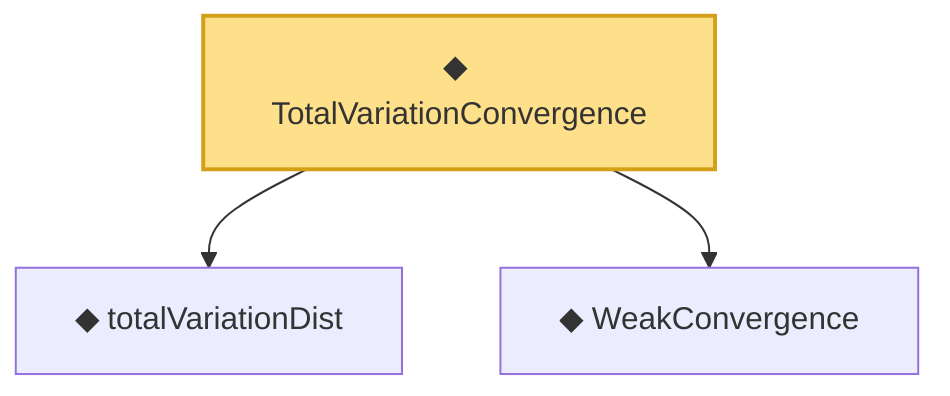

# Proof narrative — TotalVariationConvergence

Root: **TotalVariationConvergence** (def) `Statlib/StatFoundation/Convergence/AnalysisTools/ConvergenceModes.lean:145` · topic `StatFoundation`
Closure: 3 declarations across 1 files. Generated from `proof_graph.json` — no files were moved.

Reading order (foundations first, headline last):

  ◆ `totalVariationDist` — noncomputable def · `Statlib/StatFoundation/Convergence/AnalysisTools/ConvergenceModes.lean:129`
  ◆ `WeakConvergence` — def · `Statlib/StatFoundation/Convergence/AnalysisTools/ConvergenceModes.lean:163`
◆ `TotalVariationConvergence` — def · `Statlib/StatFoundation/Convergence/AnalysisTools/ConvergenceModes.lean:145` **← headline**

## Dependency diagram

