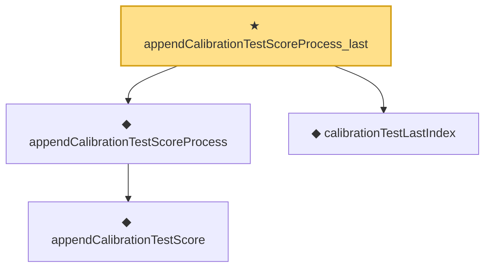

# Proof narrative — appendCalibrationTestScoreProcess_last

Root: **appendCalibrationTestScoreProcess_last** (theorem) `Statlib/StatFoundation/Statistics/Conformal.lean:99` · topic `StatFoundation`
Closure: 4 declarations across 2 files. Generated from `proof_graph.json` — no files were moved.

Reading order (foundations first, headline last):

    ◆ `appendCalibrationTestScore` — noncomputable def · `Statlib/StatFoundation/Vocabulary/Conformal.lean:66`  _(also used by 1: appendCalibrationTestScore_last)_
  ◆ `appendCalibrationTestScoreProcess` — noncomputable def · `Statlib/StatFoundation/Vocabulary/Conformal.lean:76`
  ◆ `calibrationTestLastIndex` — def · `Statlib/StatFoundation/Vocabulary/Conformal.lean:62`  _(also used by 1: appendCalibrationTestScore_last)_
★ `appendCalibrationTestScoreProcess_last` — theorem · `Statlib/StatFoundation/Statistics/Conformal.lean:99` **← headline**

## Dependency diagram

