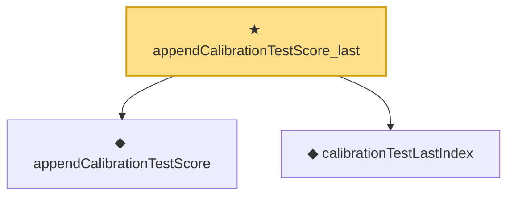

# Proof narrative — appendCalibrationTestScore_last

Root: **appendCalibrationTestScore_last** (theorem) `Statlib/StatFoundation/Statistics/Conformal.lean:92` · topic `StatFoundation`
Closure: 3 declarations across 2 files. Generated from `proof_graph.json` — no files were moved.

Reading order (foundations first, headline last):

  ◆ `appendCalibrationTestScore` — noncomputable def · `Statlib/StatFoundation/Vocabulary/Conformal.lean:66`  _(also used by 1: appendCalibrationTestScoreProcess)_
  ◆ `calibrationTestLastIndex` — def · `Statlib/StatFoundation/Vocabulary/Conformal.lean:62`  _(also used by 1: appendCalibrationTestScoreProcess_last)_
★ `appendCalibrationTestScore_last` — theorem · `Statlib/StatFoundation/Statistics/Conformal.lean:92` **← headline**

## Dependency diagram

