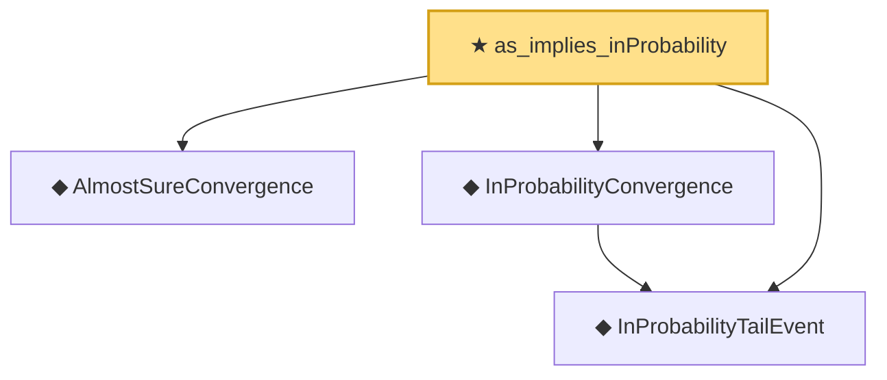

# Proof narrative — as_implies_inProbability

Root: **as_implies_inProbability** (theorem) `Statlib/StatFoundation/Convergence/AnalysisTools/ConvergenceModes.lean:176` · topic `StatFoundation`
Closure: 4 declarations across 1 files. Generated from `proof_graph.json` — no files were moved.

Reading order (foundations first, headline last):

  ◆ `AlmostSureConvergence` — def · `Statlib/StatFoundation/Convergence/AnalysisTools/ConvergenceModes.lean:35`  _(also used by 2: inProbability_implies_subseq_as, complete_implies_as)_
  ◆ `InProbabilityTailEvent` — def · `Statlib/StatFoundation/Convergence/AnalysisTools/ConvergenceModes.lean:46`  _(also used by 1: CompleteConvergence)_
  ◆ `InProbabilityConvergence` — def · `Statlib/StatFoundation/Convergence/AnalysisTools/ConvergenceModes.lean:61`  _(also used by 1: inProbability_implies_subseq_as)_
★ `as_implies_inProbability` — theorem · `Statlib/StatFoundation/Convergence/AnalysisTools/ConvergenceModes.lean:176` **← headline**

## Dependency diagram

