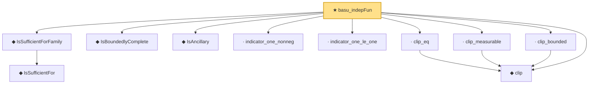

# Proof narrative — basu_indepFun

Root: **basu_indepFun** (theorem) `Statlib/StatFoundation/Statistics/Sufficiency/Basu.lean:50` · topic `StatFoundation`
Closure: 11 declarations across 2 files. Generated from `proof_graph.json` — no files were moved.

Reading order (foundations first, headline last):

    ◆ `IsSufficientFor` — def · `Statlib/StatFoundation/Statistics/Sufficiency/Basic.lean:27`
  ◆ `IsSufficientForFamily` — def · `Statlib/StatFoundation/Statistics/Sufficiency/Basic.lean:34`
  ◆ `IsBoundedlyComplete` — def · `Statlib/StatFoundation/Statistics/Sufficiency/Basic.lean:43`
  ◆ `IsAncillary` — def · `Statlib/StatFoundation/Statistics/Sufficiency/Basic.lean:39`
  · `indicator_one_nonneg` — lemma · `Statlib/StatFoundation/Statistics/Sufficiency/Basu.lean:36`
  · `indicator_one_le_one` — lemma · `Statlib/StatFoundation/Statistics/Sufficiency/Basu.lean:42`
  ◆ `clip` — def · `Statlib/StatFoundation/Statistics/Sufficiency/Basu.lean:18`
  · `clip_eq` — lemma · `Statlib/StatFoundation/Statistics/Sufficiency/Basu.lean:31`
  · `clip_measurable` — lemma · `Statlib/StatFoundation/Statistics/Sufficiency/Basu.lean:20`
  · `clip_bounded` — lemma · `Statlib/StatFoundation/Statistics/Sufficiency/Basu.lean:24`
★ `basu_indepFun` — theorem · `Statlib/StatFoundation/Statistics/Sufficiency/Basu.lean:50` **← headline**

## Dependency diagram

